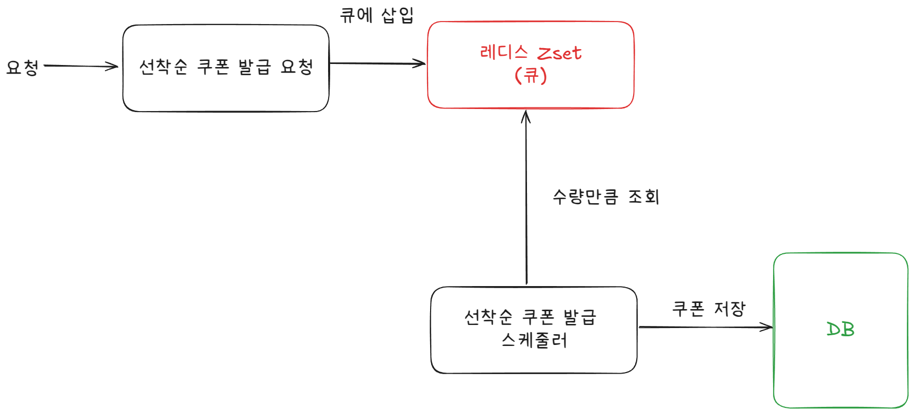

# Kafka 보고서

작성자: 홍석호

작성일: 2025-04-23

기존의 선착순 쿠폰 발급 시스템을 Kafka를 사용하여 개선하는 보고서입니다.

기존 시스템의 문제점을 파악하고, Kafka를 도입해야하는 이유와 Kafka를 사용한 선착순 쿠폰 발급 시스템의 설계 및 구현 방법을 설명합니다.

## 목차
1. [기존 시스템 문제점](#기존-시스템-문제점)
2. [Kafka를 사용한 선착순 쿠폰 발급 시스템 설계](#kafka를-사용한-선착순-쿠폰-발급-시스템-설계)
3. [구조 변경 시 예상되는 장점](#구조-변경-시-예상되는-장점)
4. [구조 변경 시 예상되는 단점](#구조-변경-시-예상되는-단점)
5. [결론](#결론)

## 기존 시스템 문제점


위 이미지는 기존의 선착순 쿠폰 발급 시스템의 구조를 나타냅니다.

기존 시스템의 문제점은 다음과 같습니다:
1. **읽고 쓰기 문제**: 쿠폰 발급 요청 큐에서 수량만큼 가져온 후 사용자 쿠폰을 조회 후 쿠폰을 발급합니다. 이 과정에서 읽기와 쓰기가 동시에 발생하여 데이터의 일관성이 깨질 수 있습니다.
추가로 여러 스케줄러에서 쿠폰 발급 요청을 처리하기 때문에 동시성 문제가 발생할 수 있습니다.
```java
transactionTemplate.executeWithoutResult(status -> {
        // 조회
        Optional<UserCoupon> optionalUserCoupon = couponRepository.findUserCouponForUpdateByUserIdAndCouponId(
            userId, coupon.getId());

        // 없으면 발급
        if (optionalUserCoupon.isEmpty()) {
          UserCoupon newUserCoupon = UserCoupon.builder()
              .userId(userId)
              .coupon(coupon)
              .build();
          couponRepository.saveUserCoupon(newUserCoupon);

          savedCount.getAndIncrement();
        }
      });
```

2. **쿠폰 상태 업데이트 문제**: 쿠폰 상태를 업데이트하는 과정에서 동시성 문제가 발생할 수 있습니다. 여러 스케줄러가 동시에 쿠폰 상태를 업데이트하려고 할 때, 데이터베이스의 레코드 락이 충돌할 수 있습니다.
```java
transactionTemplate.executeWithoutResult(
          status -> couponRepository.findForUpdateById(coupon.getId())
              .ifPresent(eventCoupon -> {
                eventCoupon.updateCouponStatus(CouponStatus.COMPLETE);
                couponRepository.saveEventCoupon(eventCoupon);
                couponRepository.save(eventCoupon);
              }));
```

3. **성능 문제**: 기존 시스템은 동시성 문제를 해결하기 위해 데이터베이스 락을 사용합니다. 이로 인해 성능이 저하될 수 있습니다.

4. **부하 조절 문제**: 기존 시스템은 레디스와 스케줄러를 통해서 부하를 조절합니다. 하지만 이 방식은 쿠폰 발급 수량이 늘어나는 경우 DB에 쿠폰 발급으로 인한 부하가 집중될 수 있습니다.

5. **데이터베이스 용량 문제**: 사용자가 많아지고 쿠폰의 개수가 늘어나면 데이터베이스의 용량이 급격히 증가할 수 있습니다. 이로 인해 데이터베이스의 성능이 저하될 수 있습니다.

## Kafka를 사용한 선착순 쿠폰 발급 시스템 설계

위 이미지는 Kafka를 사용한 선착순 쿠폰 발급 시스템의 구조를 나타냅니다.

선착순 쿠폰 발급 시 쿠폰 발급 수량 확인 후 Kafka 토픽에 메시지를 전송하고, 컨슈머가 이를 읽어서 검증 후 쿠폰을 발급합니다.

이 구조의 장점은 다음과 같습니다:
1. **큐잉을 통한 순차처리**: 쿠폰 발급 요청을 Kafka 토픽에 전송하여 순차적으로 처리합니다. 이를 통해 동시성 문제를 해결할 수 있습니다. 컨슈머가 메시지를 순차적으로 읽어들이므로, 데이터의 일관성을 유지할 수 있습니다.
2. **유연한 부하 조절**: Kafka의 파티션을 활용하여 부하를 분산시킬 수 있습니다. 컨슈머 그룹을 사용하여 여러 컨슈머가 동시에 메시지를 처리할 수 있으므로, 부하 조절이 용이합니다.

추가로, Kafka를 도입하면 쿠폰 사용에 대한 트랜잭션 분리와 사용 처리 실패 시 보상이 가능하여 쿠폰이 DB에 적재될 필요가 없고 Redis에만 저장되어도 됩니다. 
결제 시 Redis에서 쿠폰을 조회하여 사용처리하면 됩니다. 만약 실패하더라도 Kafka를 통해서 재시도 또는 보상 처리를 할 수 있습니다.

### 쿠폰 중복 발급 처리
쿠폰 중복 발급을 방지하기 위해, 쿠폰 발급 요청 시 쿠폰 ID와 사용자 ID를 함께 Kafka 메시지로 전송합니다. 컨슈머는 이 정보를 기반으로 중복 발급 여부를 판단합니다.
해당 쿠폰을 발급한 유저 목록을 가져와 중복 발급 여부를 판단하고 필터링합니다.
```java
Set<Long> alreadyIssuedUsers = couponRepository.findUserCouponsByCouponId(coupon.getId()).stream()
    .map(UserCoupon::getUserId)
    .collect(Collectors.toSet());

List<UserCoupon> newUserCoupons = filteredCommands.stream()
    .filter(command -> !alreadyIssuedUsers.contains(command.userId()))
    .map(command -> UserCoupon.builder()
        .userId(command.userId())
        .coupon(coupon)
        .isUsed(false)
        .build())
    .toList();
```

### 쿠폰 발급 배치 처리
@KafkaListener의 batch 옵션을 사용하여 쿠폰 발급을 배치로 처리합니다. 이를 통해 성능을 향상시킬 수 있습니다.
```java
@KafkaListener(topics = "coupon.v1.issue", batch = "true", concurrency = "1")
public void handleCouponBatchIssueEvent(List<CouponIssueEvent> events,
    @Header(KafkaHeaders.RECEIVED_KEY) List<String> couponIds,
    Acknowledgment ack) {
}
```
이 후에 쿠폰 서비스에 리스트로 발급되어야할 command를 전달합니다.

### 쿠폰 발급 실패 처리
쿠폰 발급 실패 시, 재시도를 최대 5회까지 시도합니다. 재시도 후에도 실패한 경우 별도로 알림을 구성해서 대응할 수 있는 시스템을 만들어야 합니다.

## 구조 변경 시 예상되는 장점
1. **동시성 문제 해결**: Kafka를 사용하여 쿠폰 발급 요청을 순차적으로 처리함으로써 동시성 문제를 해결할 수 있습니다. 컨슈머가 메시지를 순차적으로 읽어들이므로 데이터의 일관성을 유지할 수 있습니다.
2. **성능 향상**: 나중에 파티션의 확장과 여러 컨슈머가 동시에 메시지를 처리할 수 있으므로 성능이 향상됩니다.
3. **Redis와의 통합**: 쿠폰 발급 후 Redis에 쿠폰 정보를 저장하고, 결제 시 Redis에서 쿠폰을 조회하여 사용처리할 수 있습니다. 이를 통해 데이터베이스의 용량 문제를 해결할 수 있습니다.
4. **트랜잭션 분리**: 쿠폰 사용에 대한 트랜잭션을 분리하여 쿠폰 사용 처리 실패 시 보상이 가능합니다. Kafka를 통해 재시도 또는 보상 처리를 할 수 있습니다.
5. **확장성**: Kafka는 분산 시스템으로 확장성이 뛰어나며, 파티션과 컨슈머를 추가하여 처리 능력을 확장과 브로커 복제를 통해 가용성을 높일 수 있습니다.

## 구조 변경 시 예상되는 단점
1. **복잡성 증가**: Kafka를 도입함으로써 시스템의 복잡성이 증가합니다. Kafka 클러스터를 운영하고 관리해야 하며, 컨슈머와 프로듀서의 설정 및 모니터링이 필요합니다.
2. **트랜잭션 분리**: 트랜잭션을 분리함으로써 고려해야할 부분이 많아집니다. 다양한 예외 상황에 대한 처리가 필요하며, 재시도 로직과 보상 처리 로직을 구현해야 합니다.
3. **이벤트 유실**: Kafka의 경우 이벤트 유실이 발생할 수 있습니다. 이를 방지하기 위해 적절한 설정과 모니터링이 필요합니다.

## 결론
기존의 선착순 쿠폰 발급 시스템은 동시성 문제와 성능 문제로 인해 개선이 필요합니다. Kafka를 도입함으로써 동시성 문제를 해결하고, 성능을 향상시킬 수 있습니다. 
또한, Redis와의 통합을 통해 데이터베이스의 용량 문제를 해결할 수 있습니다.

추가로, Kafka를 사용하면 쿠폰 이벤트에 따라서 필요한 성능을 조절할 수 있으며, 확장성과 가용성을 높일 수 있습니다.