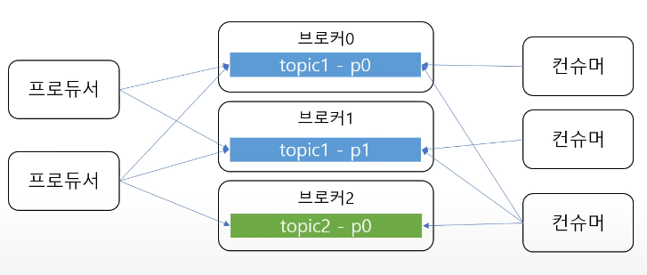
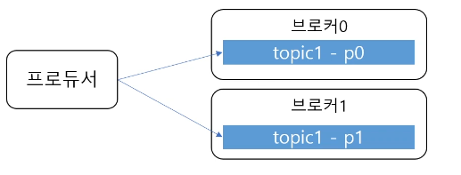
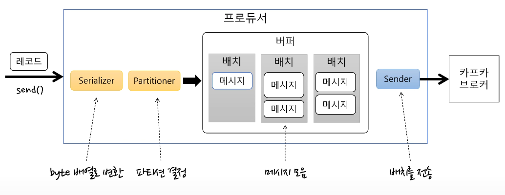
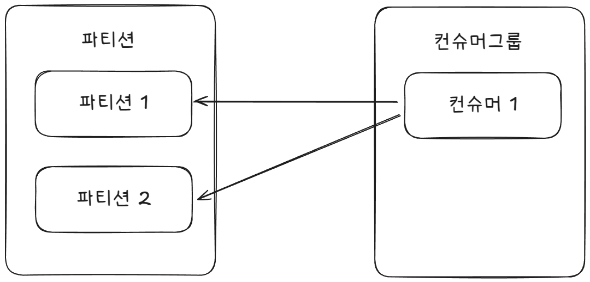
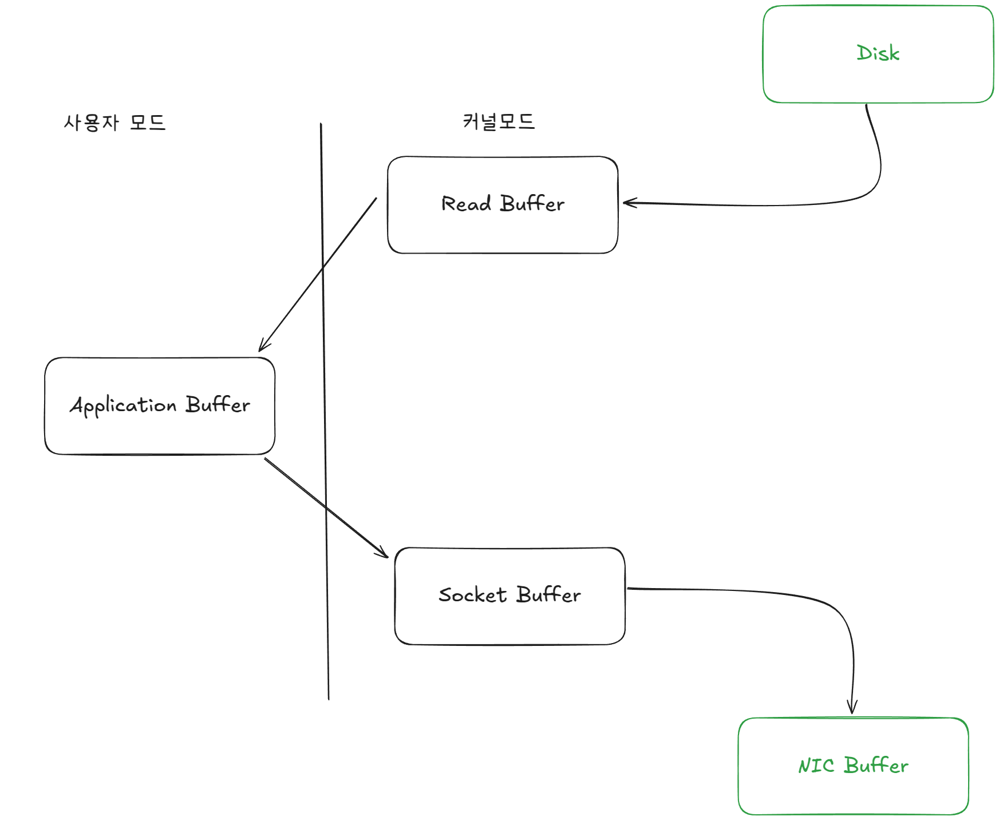
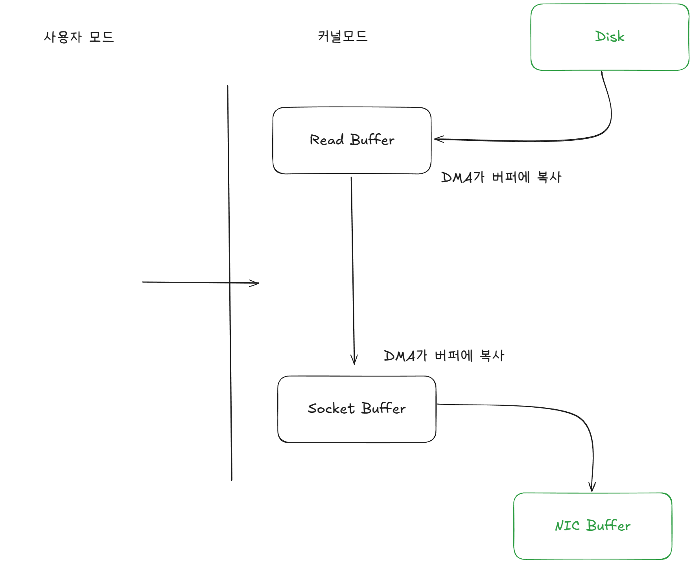
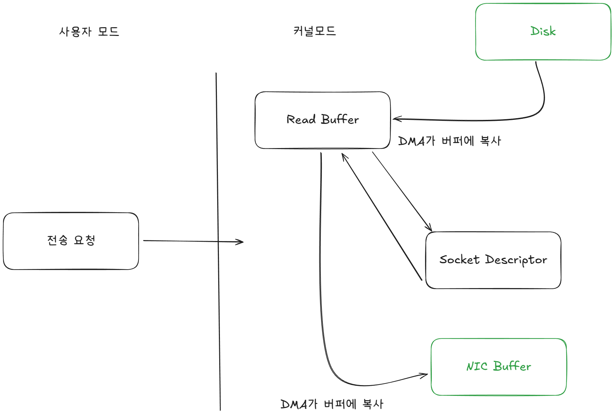

# Kafka 보고서

작성자: 홍석호

작성일: 2025-04-23

Kafka에 대한 이해도를 높이기 위해 작성된 문서입니다.

Kafka의 주요 개념과 특징을 정리했습니다.

## 목차

1. [Kafka 개요](#kafka-개요)
2. [Kafka 구성요소](#kafka-구성요소)
    1. [Producer](#producer)
    2. [Consumer](#consumer)
    3. [Broker](#broker)
    4. [Topic](#topic)
    5. [Partition](#partition)
3. [Kafka의 특징](#kafka의-특징)
   1. [고성능](#고성능)
4. [참고자료](#참고자료)

## Kafka 개요


**Kafka**는 **오픈 소스 기반의 분산 이벤트 스트리밍 플랫폼**으로 고성능 데이터 파이프라인, 스트리밍 분석, 데이터 통합 그리고 미션 크리티컬 애플리케이션을 위해서 사용됩니다.

고성능, 확장성, 영구 저장소, 고가용성과 같은 특징을 가지고 있습니다.

Kafka 에코 시스템으로 내장된 스트림 처리와 다른 시스템과의 통합, 라이브러리 지원, 큰 에코 시스템의 오픈 소스 도구들을 포함합니다.
추가로, 미션 크리티컬한 환경을 지원하기 위해 zero message loss, 효율적인 단 한 번의 처리를 지원합니다.

## Kafka 구성요소




여러 개의 브로커를 가지며 메시지를 이동하는데 핵심 역할을 하는 **카프카 클러스터**, 카프카 클러스터를 관리하는 **주키퍼 클러스터**,
카프카 클러스터에 메시지를 전송하는 **프로듀서**, 카프카 클러스터에서 메시지를 읽는 **컨슈머**로 구성됩니다.

### Topic
토픽은 Kafka에서 메시지를 구분하는 단위로 **한 개의 토픽은 한 개 이상의 파티션**으로 나뉘어져 있습니다.

### Partition
파티션은 메시지를 저장하는 물리적인 파일로 **추가만 가능한 append-only 파일 구조**입니다. 각 메시지가 저장되는 위치를 offset이라고 하며, 파티션 내에서 메시지는 순서대로 저장됩니다.
또, 일정 시간 후에 메시지가 삭제됩니다.

### Producer




프로듀서는 **라운드 로빈 또는 키를 기반으로 토픽의 파티션에 메시지를 전송**하는 역할을 합니다.

#### 프로듀서 기본 흐름
프로듀서는 한 번에 메시지를 전송하지 않고 버퍼에 메시지를 쌓아둡니다.
Sender는 별도 스레드에서 동작하며 버퍼에 쌓인 메시지를 배치 단위로 브로커에 전송합니다.
이때, 배치가 찼는지 여부에 상관없이 메시지를 전송합니다.

#### 전송결과 확인
**batch.size**는 프로듀서가 버퍼에 쌓아두는 메시지의 최대 크기를 설정합니다. 배치가 설정된 크기에 도달하면 프로듀서는 메시지를 브로커에 전송합니다.
**linger.ms**는 프로듀서가 메시지를 브로커에 전송하기 전에 대기하는 시간을 설정합니다. 이 시간 동안 프로듀서는 더 많은 메시지를 버퍼에 쌓아두고 배치 단위로 전송합니다.
0인 경우에는 즉시 전송합니다.

전송 결과를 확인하기 위해서는 아래처럼 Future 또는 Callback 방식이 필요합니다.
```java
// 전송 결과 확인 안함
producer.send(new ProducerRecord<>("simple", "value"));

// 전송 결과 확인 - Future
// 블로킹되어서 배치 효과 저하 -> 처리량 저하 발생
// 처리량이 낮아도 되는 경우에만 사용
Future<RecordMetadata> future = producer.send(new ProducerRecord<>("simple", "value"));
try{
  RecordMetadata recordMetadata = future.get(); // 블로킹

} catch(ExecutionException e) {
  
}

// 전송 결과 확인 - Callback
// 처리량 저하 없음        
producer.send(new ProducerRecord<>("simple", "value"), new Callback() {
    @Override
    public void onCompletion(RecordMetadata recordMetadata, Exception e) {
    }
});
```
**위 방식은 자주 사용하지 않고 @KafkaListener 또는 KafkaTemplate을 사용**합니다.

#### 전송 보장과 ack
ack 옵션을 통해서 프로듀서는 메시지 전송 결과를 확인할 수 있습니다.
* 0인 경우 서버 응답을 기다리지 않고 전송 보장을 하지 않습니다.
* 1인 경우 파티션의 리더에 저장되면 응답을 받고 리더 장애 시 메시지 유실이 발생할 수 있습니다.
* all 또는 -1인 경우 모든 리플리카에 저장되면 응답을 받습니다. 브로커의 min.insync.replicas 설정에 따라 달라집니다.

엄격한 전송 보장이 필요한 경우에는 all 또는 -1을 사용합니다. min.insync.replicas는 브로커 옵션으로 성공했다고 응답할 수 있는 동기화된 리플리카의 최소 개수를 설정합니다.

예를 들어, 리플리카 개수가 3이고 min.insync.replicas가 2인 경우, 리더에 저장하고 팔로워 중 한 개에 저장하면 성공으로 응답합니다.

리플리카 개수가 3이고 min.insync.replicas가 1인 경우, 리더에 저장하고 팔로워에 저장하지 않아도 성공으로 응답합니다. 이 경우에는 리더 장애 시 메시지 유실이 발생할 수 있습니다.

리플리카 개수가 3이고 min.insync.replicas가 3인 경우, 리더에 저장하고 모든 팔로워에 저장해야 성공으로 응답합니다. 
이 경우에는 리더 장애 시 메시지 유실이 발생하지 않습니다. 하지만 팔로워가 한 개라도 장애가 발생하면 리플리카 부족으로 메시지 저장에 실패합니다.

#### 에러 유형
전송 과정에서 실패가 발생할 수 있습니다.
* 일시적 네트워크 오류로 인한 전송 타임 아웃
* 리더 다운에 의한 새 리더 선출 진행 중
* 브로커 설정 메시지 크기 한도 초과
* 그 외 다양한 상황 존재

전송 전에 실패가 발생할 수 있습니다.
* 직렬화 실패, 프로듀서 자체 요청 크기 제한 초과
* 프로듀서 버퍼가 차서 기다린 시간이 최대 대기 시간 초과
* 그 외 다양한 상황 존재

#### 실패 대응
실패 시에는 아래와 같은 방법으로 대응할 수 있습니다.
* 재시도 가능한 에러는 재시도 처리
  * 재시도 가능한 예외인 경우 catch 후 재전송 또는 callback에서 재전송
  * 아주 특별한 이유가 없으면 재시도 횟수 제한 필요
  * 재시도 시에는 중복 전송 가능성에 주의 필요
* 추후 처리를 위한 기록
  * 별도 파일, DB 등에 실패한 메시지 기록

#### 재시도와 메시지 중복 전송 가능성
브로커 응답이 늦게 와서 재시도 하는 경우 메시지가 중복 전송될 수 있습니다. enable.idempotence 옵션을 사용하면 중복 전송을 방지할 수 있습니다.

#### 재시도와 전송 순서
max.in.flight.requests.per.connection은 블로킹 없이 한 커넥션에서 전송할 수 있는 최대 전송 중인 요청의 개수입니다.
이 값이 1보다 큰 경우에는 재시도 시점에 따라 메시지 순서가 바뀔 수 있습니다. 전송 순서가 중요한 경우 1로 설정해야 합니다.

### Consumer
컨슈머는 파티션의 메시지를 순서대로 읽어들이는 역할을 합니다. 컨슈머는 **컨슈머 그룹**으로 묶여서 동작하며, 각 컨슈머 그룹은 하나의 파티션에 대해서만 메시지를 읽습니다.


#### 리밸런싱

#### 컨슈머가 파티션보다 많은 경우
컨슈머가 파티션보다 많은 경우에는 파티션을 모두 읽을 수 없습니다. 결국, 유휴 컨슈머가 생기게 됩니다.
유휴 컨슈머를 두는 것이 꼭 나쁜 것은 아닙니다. 컨슈머가 장애가 발생했을 때, 유휴 컨슈머가 파티션을 읽을 수 있기 때문입니다.
하지만, 불필요한 유휴 컨슈머는 자원을 낭비하게 됩니다. 따라서, 컨슈머의 개수를 파티션의 개수와 맞추는 것이 좋습니다.

#### 컨슈머가 파티션보다 적은 경우

컨슈머가 파티션보다 적은 경우에는 컨슈머가 여러 개의 파티션을 읽게 됩니다. 이 경우, 컨슈머는 병렬로 메시지를 읽을 수 있습니다.
하지만, cpu 집약적인 작업의 경우 컨슈머의 전반적인 처리량이 낮아질 수 있습니다.

#### 커밋과 오프셋


메시지를 읽은 후 커밋을 통해서 오프셋을 저장합니다. 그 이후에는 이전에 커밋된 오프셋부터 메시지를 읽습니다.

커밋된 오프셋이 없는 경우에는 auto.offset.reset 옵션에 따라 메시지를 읽기 시작합니다.
* earliest: 카프카에 적재되어 있는 가장 오래된 오프셋부터 읽기 시작
* latest: 가장 마지막 오프셋을 사용 (기본값)
* none: 커밋된 오프셋이 없으면 예외 발생

#### 자동 커밋 / 수동 커밋
enable.auto.commit 옵션으로 자동 커밋 또는 수동 커밋을 설정할 수 있습니다.
* enable.auto.commit = true (기본값)
  * 일정 주기로 컨슈머가 읽은 오프셋을 커밋
* enable.auto.commit = false
  * 수동 커밋
  * commitSync() 또는 commitAsync() 메서드를 사용하여 커밋
* auto.commit.interval.ms
  * 자동 커밋 시 커밋 주기 (기본값 5000ms)
* poll(), close() 메서드 호출 시 자동 커밋 실행

#### 컨슈머 설정
아래 옵션들은 컨슈머의 조회에 영향을 미치는 설정입니다.
* fetch.min.bytes
  * fetch.max.bytes조회 시 브로커가 전송할 최소 데이터 크기
  * 기본값은 1Bytes
  * 이 값이 크면 대기 시간은 늘지만 처리량이 증가
* fetch.max.wait.ms
  * 데이터가 최소 크기가 될 때까지 기다릴 시간
  * 기본값 500ms
  * 브로커가 리턴할 때까지 대기하는 시간
* max.partition.fetch.bytes
  * 파티션 당 서버가 리턴할 수 있는 최대 크기
  * 기본값은 1MB

#### 재처리와 순서
일시적 커밋 실패 또는 리밸런스 등이 발생하면 동일 메시지를 조회하게 될 수도 있습니다.
**컨슈머는 데이터 특성에 따라서 멱등성(idempotence)을 고려**해야 합니다.

#### 세션 타임아웃, 하트비트, 최대 poll 간격
컨슈머는 하트비트를 전송해서 연결을 유지합니다. 브로커는 컨슈머로부터 일정 시간 동안 하트비트가 없으면 컨슈머를 그룹에서 제거하고 리밸런스를 진행합니다.
* session.timeout.ms
  * 컨슈머가 하트비트를 보내지 않는 최대 시간
  * 기본값은 10초
* heartbeat.interval.ms
  * 컨슈머가 하트비트를 보내는 주기
  * 기본값은 3초
  * session.timeout.ms의 1/3 이하 추천 (Kafka 공식 문서)
* max.poll.interval.ms
  * 컨슈머가 poll() 메서드를 호출하지 않는 최대 시간
  * 기본값은 5분
  * 이 시간 동안 poll() 메서드를 호출하지 않으면 컨슈머 그룹에서 제거되고 리밸런스가 진행

#### Consumer Group
컨슈머는 컨슈머그룹에 속하며, 한 개의 파티션은 컨슈머그룹의 한 개의 컨슈머만 연결 가능합니다.
한 컨슈머 그룹 기준으로 파티션의 메시지는 순차적으로 처리됩니다.

## Kafka의 특징

### 파티션 파일의 OS 페이지 캐시 사용
파티션에 대한 파일 I/O를 메모리에서 처리할 수 있도록 OS 페이지 캐시를 사용합니다.

파티션 파일을 읽고 쓸 때 OS 페이지 캐시를 통해서 디스크 I/O를 최소화합니다.

### Zero Copy
Zero Copy는 디스크에서 읽은 데이터를 네트워크로 전송할 때, 네트워크 버퍼로 직접 데이터를 복사합니다.


기존에는 커널이 디스크에서 데이터를 읽어서 사용자 공간으로 전송하고 사용자 공간에서 다시 네트워크 소켓의 버퍼로 복사하는 과정을 거쳤습니다.
이 과정에서 불필요한 복사로인해 CPU 사이클과 메모리 대역의 낭비가 발생합니다. **총 4번의 컨텍스트 스위칭과 4번의 복사**가 발생합니다.



Zero Copy는 이 과정을 생략하고 커널이 디스크에서 읽은 데이터를 네트워크 버퍼로 직접 전송합니다.
이를 통해, 불필요한 복사를 줄여서 애플리케이션 성능 향상과 커널과 사용자 모드 간의 컨텍스트 스위칭을 줄입니다.
**총 2번의 컨텍스트 스위칭과 3번의 복사**가 발생합니다.


한 단계 더 최적화를 수행한다면 DMA 엔진이 Read Buffer로 데이터를 전송하고 Descriptor에 버퍼의 주소를 기록합니다.
그리고 DMA엔진이 NIC의 버퍼로 데이터를 전송합니다.
이 과정에서는 복사 횟수를 한 단계 줄여서 **총 2번의 컨텍스트 스위칭과 2번의 복사**가 발생합니다.

### 브로커 단순화 구조
메시지 필터, 재전송과 같은 일은 브로커가 하지 않고 프로듀서와 컨슈머가 처리합니다. 비교적 단순한 구조로 되어 있습니다.

## 참고자료
- [Kafka 조금 아는척하기 1(개발자용)](https://www.youtube.com/watch?v=0Ssx7jJJADI)
- [Kafka 조금 아는척하기 2(개발자용)](https://www.youtube.com/watch?v=geMtm17ofPY)
- [Kafka 조금 아는척하기 3(개발자용)](https://www.youtube.com/watch?v=xqrIDHbGjOY)