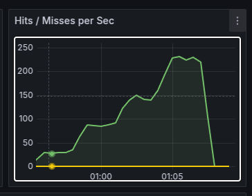

# 동시성 보고서

작성자: 홍석호

작성일: 2025-04-23

동시성 설계에 대한 이해도를 높이기 위해 작성된 문서입니다.

전체 기능 중 동시성 문제가 발생할 수 있는 기능을 파악했습니다.

해당 기능에 대한 동시성 처리 정책을 선택하고 어떤 동시성 처리 방법을 사용할 것인지에 대해서 작성했습니다.

## 목차

1. [동시성 문제](#동시성-문제)
    1. [포인트 충전 / 사용](#포인트-충전--사용)
    2. [선착순 쿠폰 발급](#선착순 쿠폰-발급)
    3. [주문 시 쿠폰 사용](#주문-시-쿠폰-사용)
    4. [주문에 대한 결제 시 잔액 사용](#주문에-대한-결제-시-잔액-사용)
    5. [주문에 대한 결제 시 재고 차감](#주문에-대한-결제-시-재고-차감)
2. [동시성 처리 정책](#동시성-처리-정책)
3. [동시성 처리 방법](#동시성-처리-방법)
4. [데드락 방지 전략](#데드락-방지-전략)
5. [동시성 테스트 전략](#동시성-테스트-전략)
6. [추후 검토 사항](#추후-검토-사항)

### 동시성 문제


아래 기능들은 공유 자원인 데이터베이스에서 한 트랜잭션이 끝나기 전에 다른 트랜잭션에 의해서 데이터의 <b>갱신 손실</b>이 발생할 수 있습니다.

즉, 의도하지 않은 데이터의 갱신이 발생할 수 있습니다.

이런 경우에는 데이터베이스의 무결성을 보장하기 위해서 동시성 처리를 해야 합니다.

#### 포인트 충전 / 사용

한 사용자가 잔액을 충전하거나 사용하고 있는 도중에 같은 사용자가 잔액을 충전하거나 사용하면, 잔액이 잘못 갱신될 수 있습니다.

#### 선착순 쿠폰 발급

동시에 여러 사용자가 쿠폰 발급 요청을 보내고 있을 때, 쿠폰이 잘못 갱신될 수도 있습니다.

#### 주문 시 쿠폰 사용

한 사용자가 쿠폰을 사용하고 있는 도중에 같은 사용자가 같은 쿠폰을 사용하면, 쿠폰이 잘못 갱신될 수 있습니다.

#### 주문에 대한 결제 시 잔액 사용

한 사용자가 결제를 하고 있는 도중에 같은 사용자가 결제 또는 충전을 하면, 잔액이 잘못 갱신될 수 있습니다.

#### 주문에 대한 결제 시 재고 차감

동시에 여러 사용자가 결제를 하고 재고를 차감하면, 재고가 잘못 갱신될 수 있습니다.

--- 

### 동시성 처리 정책

동시성 처리 정책은 경합 강도, 충돌 정도, 충돌 시 처리, 비즈니스적 관점에 따른 종합적인 중요도에 따라 결정합니다.

| 기능                | 경합 강도 | 충돌 시 처리  | 비즈니스적 관점                                                                 | 동시성 제어 방법 |
|-------------------|-------|----------|--------------------------------------------------------------------------|-----------|
| 포인트 충전 / 사용       | 낮음    | 사용자측 재시도 | 한 사용자가 동시에 포인트 충전 또는 사용 또는 결제 중 동시에 2가지 이상을 수행하는 것은 정상적인 접근이 아니라고 판단합니다. | 낙관적 락    |
| 선착순 쿠폰 발급         | 높음    | 대기       | 선착순의 관점에서 여러 사용자가 동시에 쿠폰 발급을 요청하면 이전 요청이 끝날 때까지 대기합니다.                   | 비관적 락    |
| 주문 시 쿠폰 사용        | 낮음    | 사용자측 재시도 | 한 사용자가 동시에 쿠폰을 여러 곳에서 사용하는 것은 정상적인 접근이 아니라고 판단합니다.                       | 낙관적 락    |
| 주문에 대한 결제 시 잔액 사용 | 낮음    | 사용자측 재시도 | 한 사용자가 동시에 결제 또는 충전을 하는 것은 정상적인 접근이 아니라고 판단합니다.                          | 낙관적 락    |
| 주문에 대한 결제 시 재고 차감 | 높음    | 대기       | 재고 관점에서 여러 사용자가 동시에 재고 차감을 요청하면 이전 요청이 끝날 때까지 대기합니다.                     | 비관적 락    |
| 주문에 대한 결제 시 주문 상태 변경 | 낮음    | 사용자측 재시도 | 한 사용자가 동시에 결제를 하는 것은 정상적인 접근이 아니라고 판단합니다.                                     | 낙관적 락    |

종합적으로, **경합 강도가 낮고 비즈니스적 관점에서 정상적인 접근이 아니라고 판단되는 경우에는 낙관적 락**을 사용합니다.
이는 아래와 같이 3가지 이유가 존재합니다.

1. 경합 강도가 낮기 때문에 동시성 문제가 발생할 확률이 낮습니다.
2. 비즈니스적 관점에서 정상적인 접근이 아니라고 판단되기 때문에 동시성 문제가 발생할 확률이 낮고 발생하더라도 사용자측에서 재시도하면 됩니다.
3. 낙관적 락은 비관적 락에 비해 충돌이 적고 재시도 하지 않아도 괜찮은 상황에서는 상대적으로 성능이 좋습니다.

**경합 강도가 높고 비즈니스적 관점에서 대기하는 것이 더 나은 경우에는 비관적 락**을 사용합니다.
이는 아래와 같이 2가지 이유가 존재합니다.

1. 경합 강도가 높기 때문에 동시성 문제가 발생할 확률이 높습니다.
2. 비즈니스적 관점에서 무조건 순차적으로 수행되어야 하는 선착순 쿠폰 발급과 재고 차감의 경우에는 대기하는 것이 실패 후 재시도하는 것보다 더 낫습니다.
3. 비관적 락은 충돌이 발생할 확률이 높기 때문에 대기하는 것이 더 나은 경우에는 비관적 락을 사용합니다.

--- 

### 동시성 처리 방법
#### 낙관적 락
낙관적 락은 JPA에서 제공하는 @Version 어노테이션을 사용하여 구현합니다.
낙관적 락은 데이터베이스에서 트랜잭션을 시작할 때, 해당 데이터에 대한 버전 정보를 가져옵니다.
이후 트랜잭션이 끝날 때, 해당 데이터의 버전 정보와 가져온 버전 정보를 비교하여 다르면 충돌로 판단하고 예외를 발생시킵니다.
```java
@Version
private Long version;
```

```SQL
UPDATE user_point
SET amount = amount + 1000, version = version + 1
WHERE id = 1 AND version = 1;
```

#### 비관적 락
비관적 락은 JPA에서 제공하는 @Lock 어노테이션을 사용하여 구현합니다.
비관적 락은 데이터베이스에서 트랜잭션을 시작할 때, 해당 데이터에 대한 락을 걸고 트랜잭션이 끝날 때까지 락을 유지합니다.

<u>**주의: 비관적 락은 데이터베이스에서 락을 걸기 때문에 성능에 영향을 미칠 수 있습니다. 가능한한 트랜잭션 범위와 락을 획득하고 사용할 범위를 최소화해야 합니다.**</u>

```java
@Lock(LockModeType.PESSIMISTIC_WRITE)
Coupon findById(Long id);
```

```SQL
SELECT * FROM coupon WHERE id = 1 FOR UPDATE;
```

### 데드락 방지 전략
비관적 락을 사용하는 경우 데드락이 발생하면 트랜잭션이 무한정 대기하게 되므로, 이를 방지하기 위해서는 아래와 같은 방법을 사용합니다.

1. 트랜잭션의 범위를 최소화합니다.
```java
transactionTemplate.execute(status -> {
    // 트랜잭션 범위 최소화
    return null;
});

apiCall();
```
2. 트랜잭션의 타임아웃을 설정합니다.
```java
transactionTemplate.setTimeout(5); // 5초

@Transactional(timeout = 5)
```
3. 락 획득 타임아웃을 설정합니다.
```java
@QueryHints({@QueryHint(name = "javax.persistence.lock.timeout", value ="5000")})
```
4. 락에 소유와 해제 구간을 최소화합니다.
```java
@Transactional
public UserCoupon issue(User user, Long couponId) {
  // 락 획득
   Coupon coupon = couponRepository.findForUpdateById(couponId)
        .orElseThrow(() -> new CouponNotFoundException("쿠폰을 찾을 수 없습니다."));

   UserCoupon userCoupon = coupon.issue(user);
   couponRepository.save(coupon);

   return couponRepository.saveUserCoupon(userCoupon);
   // 락 해제
}
```

### 동시성 테스트 전략
동시성은 단 2개의 트랜잭션이 동시에 수행되는 것만으로도 발생할 수 있습니다.
따라서 동시성 테스트는 아래와 같은 방법으로 수행합니다.

성공 또는 실패 횟수가 아닌 값 비교를 수행하는 경우, then에서 값을 조회 후 검증합니다.

```java
import java.util.concurrent.atomic.AtomicInteger;@Test
void concurrencyTest() throws InterruptedException {
    // given
    CountDownLatch latch = new CountDownLatch(2);
    int threadCount = 2;
    User user = new User();
    int couponAmount = 1;
    
    // when
    AtomicInteger successCount = new AtomicInteger(0);
    AtomicInteger failureCount = new AtomicInteger(0);
    for (int i = 0; i < threadCount; i++) {
        new Thread(() -> {
            try {
              couponService.issue(user);
              
              successCount.incrementAndGet();
            } catch (Exception e) {
                failureCount.incrementAndGet();
            } finally {
                latch.countDown(); // 카운트다운
            }
        }).start();
    }
    
    latch.await(); // 모든 작업이 끝날 때까지 대기
   
   // then
   assertThat(successCount.get()).isEqualTo(1); // 성공한 스레드 수
   assertThat(failureCount.get()).isEqualTo(1); // 실패한 스레드 수
}
```

### 추후 검토 사항
현재 상품 재고 차감에 대한 연산이 상품 옵션 목록을 받아서 순회하면서 차감하고 save하는 구조입니다.

이 경우에는 다건의 상품 재고에 대해서 락을 획득하고 재고를 차감하는 구조이기 때문에 성능에 영향을 미칠 수 있습니다.

추후에 상품 재고 차감을 수행한 후 bulk update로 변경해 락을 더 빠르게 해제할 수 있도록 개선할 필요가 있습니다.
또한, 너무 많은 상품 재고에 대한 락 획득을 방지하기 위해 주문 또는 결제에서 최대 상품 옵션 수에 대한 제한을 두어야 합니다.