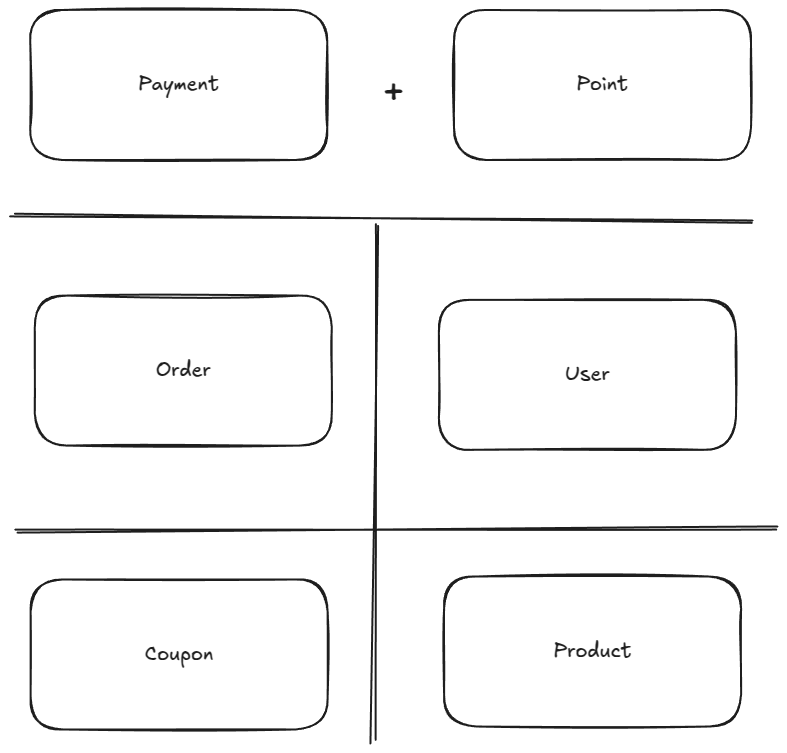
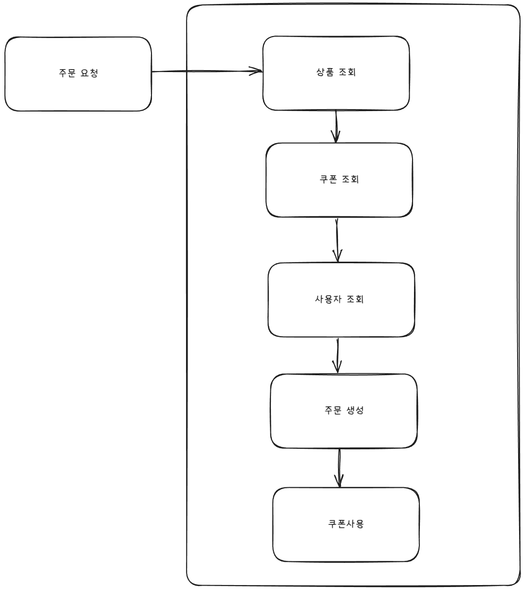
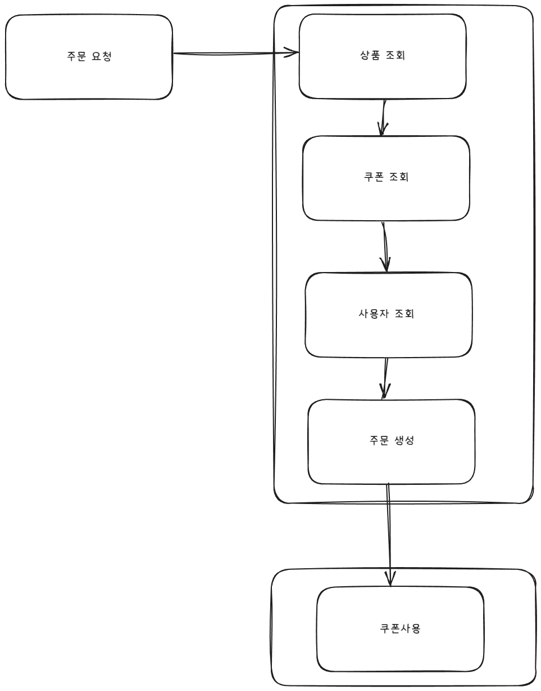
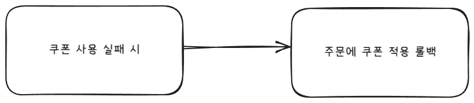
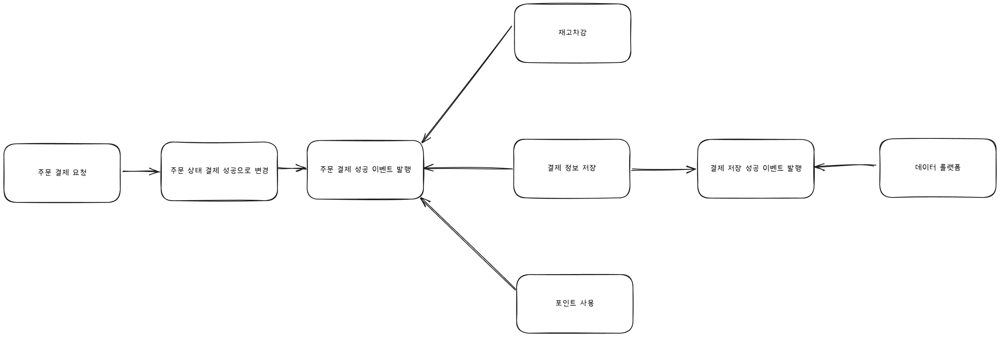
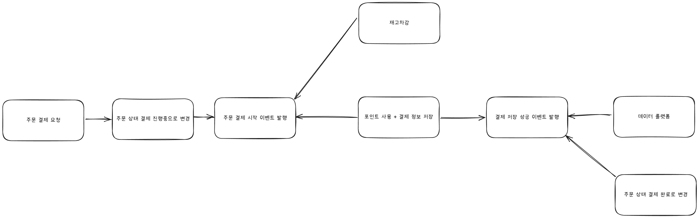
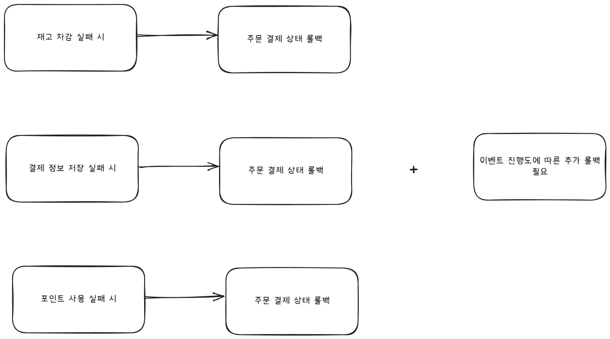

# MSA 형태로 배포 단위 분리와 트랜잭션 분리 설계 문서

작성자: 홍석호

작성일: 2025-04-04

서비스의 규모가 확장되어 MSA 형태로 배포 단위를 분리하고 트랜잭션을 분리하는 설계 문서입니다.

도메인 단위의 경계를 정의하고 트랜잭션을 분리했을 때 발생할 수 있는 문제점과 해결 방안에 대한 설명을 포함합니다.

## 목차

1. [도메인 단위 경계 정의](#도메인-단위-경계-정의)
2. [트랜잭션 분리 설계 및 문제점](#트랜잭션-분리-설계-및-문제점)
    1. [주문 시 트랜잭션 분리](#주문-시-트랜잭션-분리)
    2. [주문 결제 시 트랜잭션 분리](#주문-결제-시-트랜잭션-분리)
5. [결론](#결론)

## 도메인 단위 경계 정의

도메인 단위 경계는 다음과 같이 정의합니다.

- User
- Coupon
- Order
- Payment + Point
- Product

위와 같은 도메인 단위 경계는 서비스의 비즈니스 로직을 기준으로 정의되었습니다.
**각 도메인은 서로 독립적으로 동작하며, 각 도메인 간의 의존성을 최소화**하여 MSA 형태로 배포할 수 있도록 설계되었습니다.

추가로 Payment 도메인은 Point 도메인과 결합되어 있습니다.
그 이유는 Point 도메인은 Payment 도메인과 밀접하게 연관되어 있기 때문입니다.

## 트랜잭션 분리 설계 및 문제점

### 주문 시 트랜잭션 분리

#### AS-IS

현재의 주문 생성 트랜잭션은 위의 이미지와 같이 **상품 조회 -> 쿠폰 조회 -> 사용자 정보 조회 -> 주문 생성 -> 쿠폰 사용 처리** 순으로 진행됩니다.

#### TO-BE

MSA 형태로 배포 단위를 분리하고 트랜잭션을 분리하면 위의 이미지와 같이 **상품 조회 -> 쿠폰 조회 -> 사용자 정보 조회 -> 주문 생성**과 **쿠폰 사용 처리**가 분리됩니다.

분리된 트랜잭션이므로 앞선 트랜잭션의 성공에 의존하지 않고 독립적으로 동작합니다.
그래서 주문 생성 트랜잭션이 성공하더라도 쿠폰 사용 트랜잭션은 실패할 수 있습니다.
이때에는 보상 트랜잭션을 수행하여 쿠폰 사용을 롤백합니다.

아래의 그림처럼 주문 성공 시에는 쿠폰 사용 이벤트를 발급합니다.
만약 쿠폰 사용에 실패하면 보상 트랜잭션을 사용하여 쿠폰 사용을 롤백합니다.

### 주문 결제 시 트랜잭션 분리
#### AS-IS

현재의 주문 결제 트랜잭션은 위와 그림 같이 하나의 트랜잭션으로 묶여있으며, 주문 결제 성공 상태로 변경하고 주문 결제 성공 이벤트를 발행합니다.

그 후에 재고차감, 결제 정보 저장, 포인트 사용이 해당 이벤트를 받아 처리합니다.

#### TO-BE

MSA 형태로 배포 단위를 분리하고 트랜잭션을 분리하면 구조는 변경되지 않으나 주문 결제 상태 변경, 재고 차감, 결제 정보 저장, 포인트 사용이 분리됩니다.

이런 형태로 변경되면 주문에 "PENDING" 상태를 추가합니다. 결제가 성공하면 이벤트 발행을 통해 주문 결제 상태를 "COMPLETE"로 변경합니다.

이때 주문 결제 상태 변경, 재고 차감 트랜잭션이 성공하더라도 결제 정보 저장, 포인트 사용 트랜잭션은 실패할 수 있습니다.

이때에는 보상 트랜잭션을 수행하여 주문 결제 상태를 롤백합니다. 추가로 재고 차감도 보상 트랜잭션을 수행하여 롤백합니다.

단순히 주문 결제 상태를 롤백하는 것이 아니라 이벤트 수신에 따른 추가 롤백 작업이 필요합니다.

### 결론
MSA 형태로 배포 단위를 분리하고 트랜잭션을 분리하는 것은 규모가 커짐에 따라 서비스의 확장성과 유지보수성을 높이는 데 큰 도움이 됩니다.
하지만 트랜잭션 분리 때문에 발생하는 일관성 문제가 존재합니다.
분리된 트랜잭션에서 일관성 문제를 해결하기 위해 2-Phase Commit, SAGA 패턴과 같은 보상 트랜잭션을 도입할 수 있습니다.
보상 트랜잭션은 추가적인 복잡성을 초래할 수 있지만, 서비스의 안정성과 일관성을 유지하는 데 필수적입니다.

MSA 환경에서 각 도메인 간의 의존성을 최소화하고 독립적으로 동작할 수 있도록 설계하는 것이 중요합니다.
이를 위해 부분적으로 이벤트를 도입해 이벤트를 발행하고 수신하는 구조로 변경하여 각 도메인이 독립적으로 동작할 수 있도록 합니다.