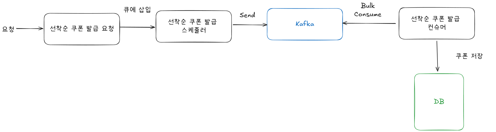
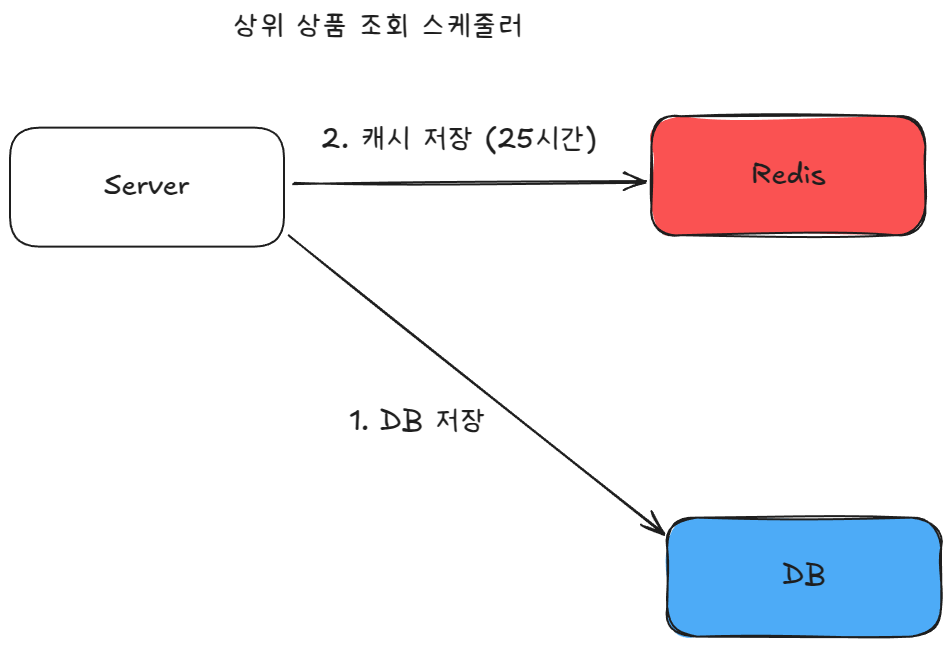
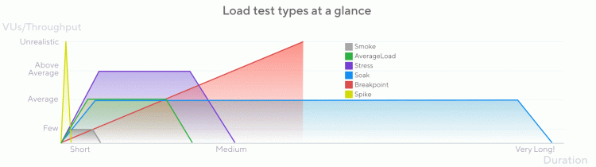

# 부하 테스트 계획서

**작성자**: 홍석호  
**작성일**: 2025-06-04  
**버전**: 1.0

## 개요

핵심 기능 2개(선착순 쿠폰 발급, 상위 상품 조회)의 부하 테스트 계획을 제시합니다. **단일 서버(t2.micro)의 최대 처리 능력**을 측정하여 분산 환경에서 필요한 서버 대수를 산정합니다.

**서비스 규모 가정**:
- DAU: 100,000명
- 평균 동시 접속자: 2,500-3,000명 (DAU 2.5~3% 가정)
- 이벤트 시 최대 동시 접속: 8,000-10,000명(DAU 8-10% 가정)

**테스트 목적**: 
서버 한 대가 처리할 수 있는 최대 부하 측정 → 전체 트래픽 분산 설계에 활용

**이 문서의 결과물:**
- 부하 테스트 대상 기능과 선정 기준
- 기능별 상세 테스트 시나리오
- 테스트 환경 구성 방법
- k6 스크립트 구현 가이드
- 부하 테스트 결과

---

## 부하 테스트 대상 기능

### 1. 선착순 쿠폰 발급

**기능**: 제한된 수량의 쿠폰을 선착순으로 발급

**선정 이유**: 이벤트 시작 시점에 동시 요청이 집중되어 시스템에 최대 부하를 발생시키는 기능

**아키텍처**:

**측정 목표**:
- p99 기준 응답 시간 250ms 이하
- **단일 서버 최대 TPS 측정**
- 쿠폰 발급 성공률과 중복 발급률
- 성능 한계점에서의 응답 시간 분포

### 2. 상위 상품 조회

**기능**: 판매량 기준 상위 상품 목록 조회

**선정 이유**: 메인 페이지 노출로 높은 조회 빈도와 지속적인 트래픽 발생

**아키텍처**:

**측정 목표**:
- p99 기준 응답 시간 250ms 이하
- **단일 서버 최대 조회 TPS 측정**
- Redis 캐시 히트율 (목표: 90% 이상)
- 성능 한계점에서의 응답 시간 분포

---

## 테스트 시나리오

### 1. 선착순 쿠폰 발급 시나리오

**테스트 데이터**:
- 1개의 쿠폰 1,000개의 수량
- 쿠폰 데이터 Redis에 캐싱
- MySQL에 쿠폰과 사용자 정보 저장

**트래픽 패턴**: 점진적 스파이크 (단일 서버 한계 측정)
- 100명 → 200명 → 500명 → 1,000명까지 점진적 증가
- 각 단계마다 성능 지표 측정
- 에러율 5% 초과 시점을 서버 한계로 판단

**측정 지표**:
- 쿠폰 발급 요청 성공률
- 중복 발급률
- 초당 트랜잭션 처리 수(TPS)
- p99.9, p99, p95, p80, p50, avg 응답 시간

### 2. 상위 상품 조회 시나리오

**테스트 데이터**:
- Redis에 상위 상품 데이터 캐싱
- MySQL에 10000개의 상품 데이터에 대해서 상품별 재고 정보 저장

**트래픽 패턴**: 점진적 부하 증가 (단일 서버 한계 측정)
- 평상시: 100명 → 300명 → 500명 → 800명 단계적 증가
- 각 단계에서 5분간 유지하며 성능 측정
- 응답 시간 1초 초과 또는 에러율 1% 초과 시 한계 판단

**측정 지표**:
- 캐시 히트율
- 초당 트랜잭션 처리 수(TPS)
- p99.9, p99, p95, p80, p50, avg 응답 시간

---

## 테스트 환경

**클라우드 환경 (AWS 기준)**:
- EC2 t2.micro: 1 vCPU, 1GB RAM (최소 스펙 유지)
- RDS MySQL t4g.micro: 2 vCPU, 1GB RAM
- ElastiCache Redis t4g.micro: 2 vCPU, 1GB RAM
- MSK Kafka m7g.large: 2 vCPU, 8GB RAM

**로컬 환경**: Docker Compose로 동일 스펙 구성

**목적**: 최소 스펙 서버 한 대의 처리 한계 측정 → DAU 10만명 대응 시 필요 서버 대수 산정

---

## 테스트 도구 및 스크립트

**사용 도구**: k6 (오픈소스 부하 테스트 도구)

## 부하 테스트 결과
### 선착순 쿠폰 발급

- **가상 사용자**: 100 -> 200 -> 500 -> 1000
- **p99 응답 시간**: 21.1ms
- **쿠폰 발급 성공률**: 수량만큼 발급 성공

### 상위 상품 조회

- **가상 사용자**: 100 -> 300 -> 500 -> 800
- **p99 응답 시간**: 24.97ms
- **캐시 히트율**: 100%