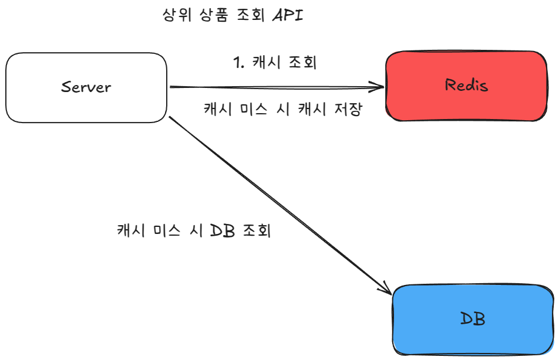

# 부하 테스트 계획서

**작성자**: 홍석호  
**작성일**: 2025-04-04  
**버전**: 1.0

## 개요

핵심 기능 3개(선착순 쿠폰 발급, 상위 상품 조회, 주문 요청)의 부하 테스트 계획을 제시합니다. 각 기능의 성능 한계를 측정하고 시스템 안정성을 검증해 운영 환경의 적정 트래픽 수용량을 결정합니다.

**이 문서의 결과물:**
- 부하 테스트 대상 기능과 선정 기준
- 기능별 상세 테스트 시나리오
- 테스트 환경 구성 방법
- k6 스크립트 구현 가이드

---

## 부하 테스트 대상 기능

### 1. 선착순 쿠폰 발급

**기능**: 제한된 수량의 쿠폰을 선착순으로 발급

**선정 이유**: 이벤트 시작 시점에 동시 요청이 집중되어 시스템에 최대 부하를 발생시키는 기능

**아키텍처**:


**측정 목표**:
- 스파이크 트래픽에서 최대 TPS
- 쿠폰 발급 성공률과 중복 발급률
- 응답 시간 분포 (p99.9 ~ avg)

### 2. 상위 상품 조회

**기능**: 판매량 기준 상위 상품 목록 조회

**선정 이유**: 메인 페이지 노출로 높은 조회 빈도와 지속적인 트래픽 발생

**아키텍처**:



**측정 목표**:
- 평상시와 피크 타임 TPS
- Redis 캐시 히트율
- 응답 시간 분포 (p99.9 ~ avg)

### 3. 주문 요청

**기능**: 상품 주문 처리

**선정 이유**: 비즈니스 핵심 기능으로 모든 상황에서 안정적 처리 필요

**아키텍처**:


**측정 목표**:
- 동시 주문 처리 TPS
- 주문 성공률
- 응답 시간 분포 (p99.9 ~ avg)

---

## 테스트 시나리오


### 1. 선착순 쿠폰 발급 시나리오

**테스트 데이터**:
- 쿠폰 1,000개 발급
- 가상 사용자 100명부터 100명씩 증가

**트래픽 패턴**: 스파이크
- 이벤트 시작과 동시에 모든 사용자 요청
- 쿠폰 소진 또는 시간 종료까지 지속

**측정 지표**:
- 쿠폰 발급 요청 성공률
- 중복 발급률
- 초당 트랜잭션 처리 수(TPS)
- p99.9, p99, p95, p80, p50, avg 응답 시간

### 2. 상위 상품 조회 시나리오

**테스트 데이터**:
- Redis에 상위 상품 데이터 저장
- MySQL에 상품별 재고 정보 저장

**트래픽 패턴**: 평균 부하 + 스파이크 부하
- 기본: 100명 지속 조회
- 피크: 트래픽 2-3배 증가

**측정 지표**:
- 캐시 히트율
- 초당 트랜잭션 처리 수(TPS)
- p99.9, p99, p95, p80, p50, avg 응답 시간

### 3. 주문 요청 시나리오

**테스트 데이터**:
- MySQL에 다양한 상품 데이터 저장
- 상품별 충분한 재고 설정

**트래픽 패턴**: 평균 부하 + 스파이크 부하
- 기본: 100명 지속 주문
- 피크: 이벤트 상황 시뮬레이션

**측정 지표**:
- 주문 성공률
- 초당 트랜잭션 처리 수(TPS)
- p99.9, p99, p95, p80, p50, avg 응답 시간

---

## 테스트 환경

**클라우드 환경 (AWS 기준)**:
- EC2 t2.micro: 1 vCPU, 1GB RAM
- RDS MySQL t4g.micro: 2 vCPU, 1GB RAM  
- ElastiCache Redis t4g.micro: 2 vCPU, 1GB RAM
- MSK Kafka m7g.large: 2 vCPU, 8GB RAM

**로컬 환경**: Docker Compose로 동일 스펙 구성

---

## 테스트 도구 및 스크립트

**사용 도구**: k6 (오픈소스 부하 테스트 도구)

### 선착순 쿠폰 발급 스크립트
```javascript
// 구현 예정
```

### 상위 상품 조회 스크립트  
```javascript
// 구현 예정
```

### 주문 요청 스크립트
```javascript  
// 구현 예정
```