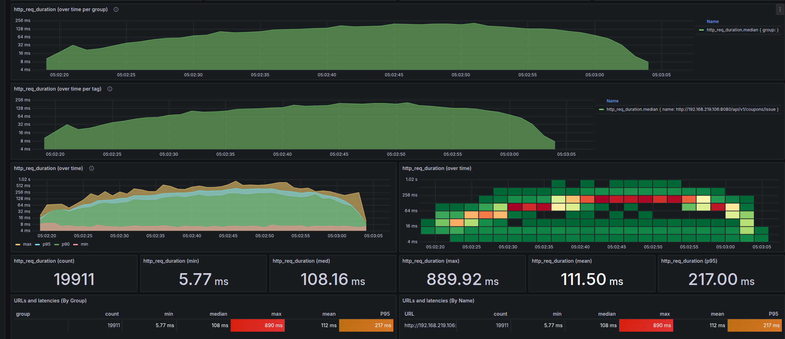
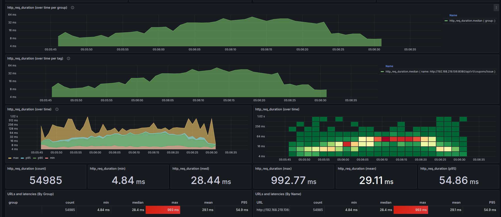
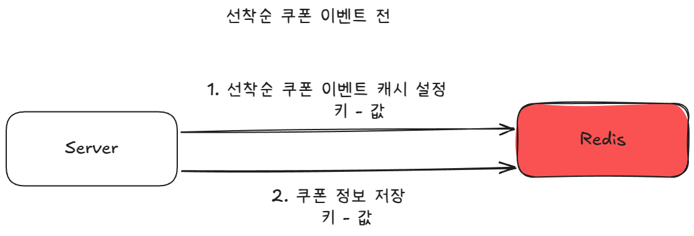
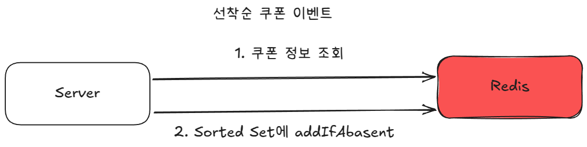
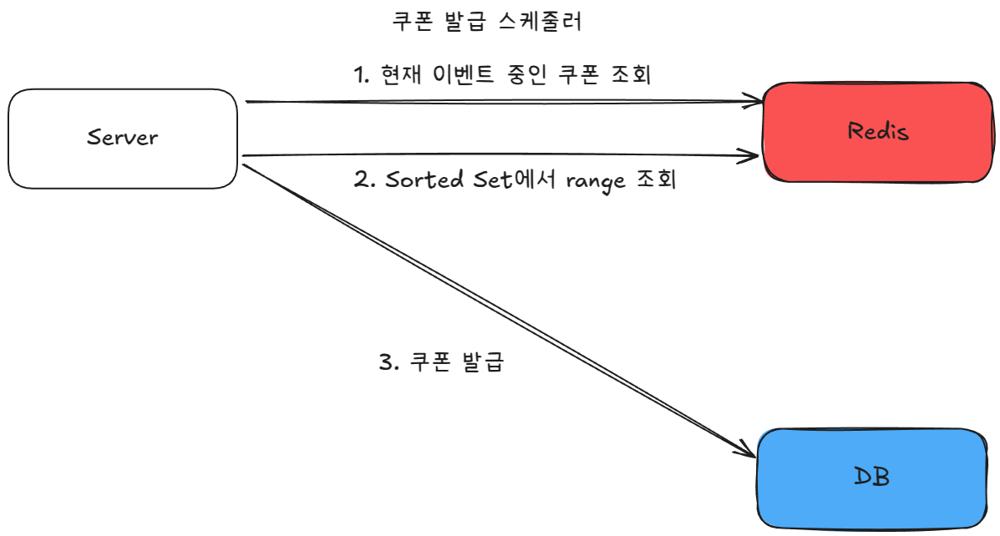
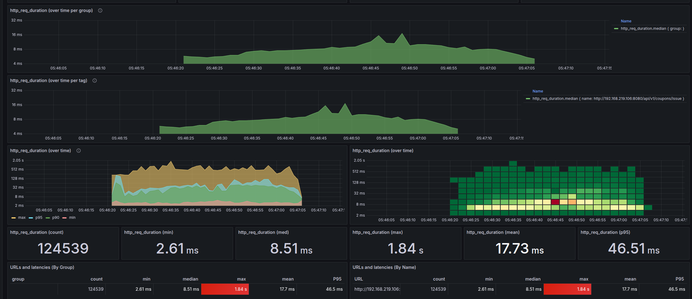
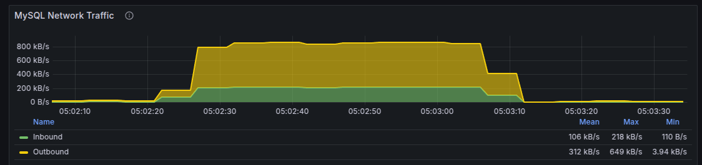
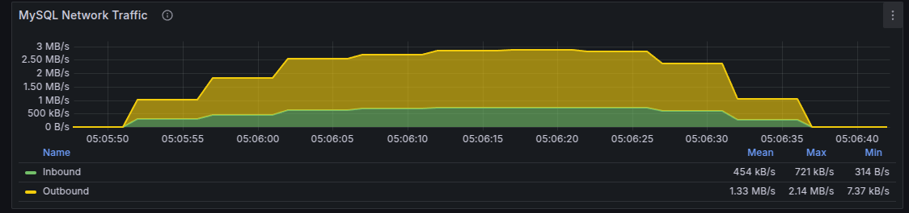
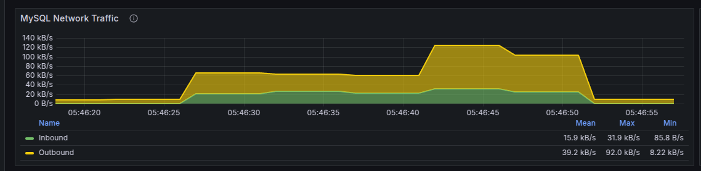

# 쿼리 분석 및 개선 문서

작성자: 홍석호

작성일: 2025-04-04

선착순 쿠폰 발급 시스템의 개선된 디자인을 제안하는 문서입니다.

기존 선착순 쿠폰 발급 시스템의 문제점과 개선된 디자인이 어떻게 그 문제점을 극복하는지에 대한 설명을 포함합니다.

성능 테스트 환경은 Intel® Core™ i5-10400 CPU @ 2.90GHz × 12, Ram 32GB, SSD 2.6TB입니다.
인텔리제이 IDE에서 실행한 스프링 애플리케이션과 Docker로 기동한 MySQL, Redis를 사용했습니다.

## 목차

1. [선착순-쿠폰-발급](#선착순-쿠폰-발급)
    1. [선착순-쿠폰-발급-API-문제점-분석](#선착순-쿠폰-발급-API-문제점-분석)
    2. [선착순-쿠폰-발급-API-개선-방안](#선착순-쿠폰-발급-API-개선-방안)
    3. [구조-변경-시-예상되는-장점](#구조-변경-시-예상되는-장점)
    4. [구조-변경-시-예상되는-단점](#구조-변경-시-예상되는-단점)
    5. [결론](#결론)

## 선착순 쿠폰 발급

선착순 쿠폰 발급의 핵심은 정해진 개수만큼의 쿠폰을 정확히 발급해야 합니다.
추가로 선착순 쿠폰 발급은 동시성 문제, 스파이크 형태의 트래픽을 해결하고 때로는 정합성을 유지해야 합니다.

### 선착순 쿠폰 발급 API 문제점 분석

```java
@DistributedLock
@Transactional

// DB 락과 함께 로직 진행
```

쿠폰 발급 파사드에는 @DistributedLock을 통해서 분산락이 걸려있습니다.
분산락을 통해서 데이터베이스의 충돌을 줄여 과도하게 데이터베이스 자원을 사용하는 것을 방지합니다.

만약, 데이터베이스가 이원화된 구조라면, 분산락을 통해서 동시성 문제를 해결할 수 있습니다.




분산락 사용 시 45초 동안 총 요청 수 19911개일 때 기준 **p95 기준 응답속도는 217ms**입니다.



분산락 미사용 시 45초 동안 총 요청 수 54985개일 때 **p95 기준 응답속도는 54.86ms**입니다.

분산락은 전반적인 응답속도를 향상시키지 않습니다. 데이터베이스 락을 여전히 사용하면서 추가 오버헤드가 발생하기 때문입니다. 
다만, 분산락이 동시성을 먼저 제어하여 데이터베이스의 레코드 락 충돌 빈도는 낮춥니다.

쿠폰 발급의 특성상 동시성 문제를 해결하면서도 높은 동시 처리 성능을 요구합니다. 그래서 현재 구조를 개선할 필요가 있습니다.

### 선착순 쿠폰 발급 API 개선 방안

선착순 쿠폰 발급 API를 큐 구조를 사용해 개선합니다. 이때 큐는 Redis를 사용합니다.

특히, Redis의 Sorted Set 자료구조를 사용하여 선착순 쿠폰 발급을 구현합니다.

**개선된 선착순 쿠폰 발급의 전체적인 흐름**은 아래와 같습니다.
1. 쿠폰 발급 이벤트가 생기면 이벤트 쿠폰을 캐시에 저장합니다.
2. 쿠폰 발급 요청이 들어오면 Redis의 Sorted Set(큐)에 사용자 아이디와 현재 시간을 저장합니다. Sorted Set의 Score는 현재 시간으로 설정합니다.
3. 1초마다 돌아가는 스케줄러를 통해서 Sorted Set에서 쿠폰 발급 요청을 가져옵니다.
4. 발급 요청들을 순회하면서 쿠폰을 발급합니다. 
5. 쿠폰 발급 작업의 효율성을 위해 발급이 완료되어서 쿠폰의 상태가 바뀌거나 쿠폰이 만료된 경우 이벤트 쿠폰을 캐시에서 제거합니다.

List를 사용하면 선착순으로 발급할 수 있지만, 중복된 쿠폰을 발급할 수 있습니다. Set을 사용하면 중복된 쿠폰을 발급할 수 없지만, 선착순으로 발급할 수 없습니다.
**Sorted Set**은 중복 발급을 방지하면서도 선착순 처리가 가능합니다.



사전에 쿠폰 발급 이벤트가 발생하면 쿠폰을 캐시에 저장합니다.



쿠폰 발급 요청이 들어오면 Redis의 Sorted Set(큐)에 사용자 아이디(value)와 현재 시간(score)을 저장합니다.



1초마다 돌아가는 스케줄러를 통해서 Sorted Set에서 쿠폰 발급 요청을 가져옵니다. 발급 요청들을 순회하면서 쿠폰을 발급합니다.

발급이 전부 완료가 되면 사전에 저장된 쿠폰 정보 캐시를 제거하고 DB에 쿠폰의 상태를 업데이트합니다.

### 구조 변경 시 예상되는 장점



구조 변경 후 45초 동안 총 요청 수 124539개일 때 **p95 기준 응답속도는 46.51ms**입니다.

1. **성능 대폭 향상**: Sorted Set을 사용하여 선착순 쿠폰 발급을 구현하면 성능이 향상됩니다.
    - Sorted Set은 중복된 쿠폰을 발급할 수 없고, 선착순으로 발급할 수 있습니다.
    - 선착순 쿠폰 발급의 구조를 Sorted Set을 사용한 큐잉을 통해서 구현하여 요청과 처리를 분리해서 처리량과 성능을 향상시켰습니다.
    - TPS 기준으로 보면 분산락을 사용한 경우 442.4 TPS, 미사용한 경우 1200 TPS, 구조 변경 후에는 2670 TPS입니다.
    - 구조 변경 후에는 TPS 기준으로 약 2배에서 6배까지 성능이 향상되었습니다. 성능은 약 14% 향상되었습니다.



분산락 사용 버전 db 네트워크 부하



분산락 미사용 버전 db 네트워크 부하



구조 변경 후 db 네트워크 부하

구조 변경 후 그림을 보면 구조 개선 후 요청 수는 최소 2배 최대 6배까지 늘었지만 네트워크로부터 오는 부하가 줄어들었습니다.

2. **DB 자원 절약**: Sorted Set을 사용하여 선착순 쿠폰 발급을 구현하면 DB 자원을 절약할 수 있습니다.
    - 한 번에 많은 요청을 바로바로 처리하는 것이 아닌 큐를 통해서 처리하므로 DB 자원을 절약할 수 있습니다.

### 구조 변경 시 예상되는 단점

1. **사용자 경험 저하**: Sorted Set을 사용하여 선착순 쿠폰 발급을 구현하면 발급 요청 시점에 성공/실패를 알 수 없어 사용자 경험이 저하될 수 있습니다.
    - 개선된 구조에서는 사용자가 쿠폰 발급에 성공/실패하는 것을 발급 요청 시점에 알 수 없습니다.

2. **레디스의 고가용성 확보 및 관리**: 발급된 쿠폰을 저장하고 발급 요청을 처리하는 부분에서 Redis를 사용합니다.
    - Redis의 장애 발생 시에도 서비스가 중단되지 않도록 구성해야 합니다.

### 결론

**선착순 쿠폰 발급 API를 Redis의 Sorted Set을 사용**하여 선착순 쿠폰 발급을 구현하면 성능을 향상시키고 DB 자원을 절약할 수 있습니다.
사용자 경험 저하는 푸시 알림, 쿠폰함 이동 등 다른 방법으로 보완할 수 있습니다.

레디스의 고가용성 확보 및 관리가 필요하지만 이에 따라 얻을 수 있는 성능 향상과 DB 자원 절약은 충분히 가치가 있습니다.

### 추가 개선 사항
쿠폰 조회를 레디스가 아닌 로컬 캐시를 사용하여 성능을 향상시킬 수 있습니다.

또, 현재는 쿠폰 저장 시 동시성 문제를 해결하기 위해서 비관적락을 사용하고 있습니다. 하지만 이는 쿠폰을 발급해 데이터베이스에 저장할 때 발생하므로
캐시에 두고 해당 캐시를 사용하여 쿠폰 사용을 처리할 수 있습니다.