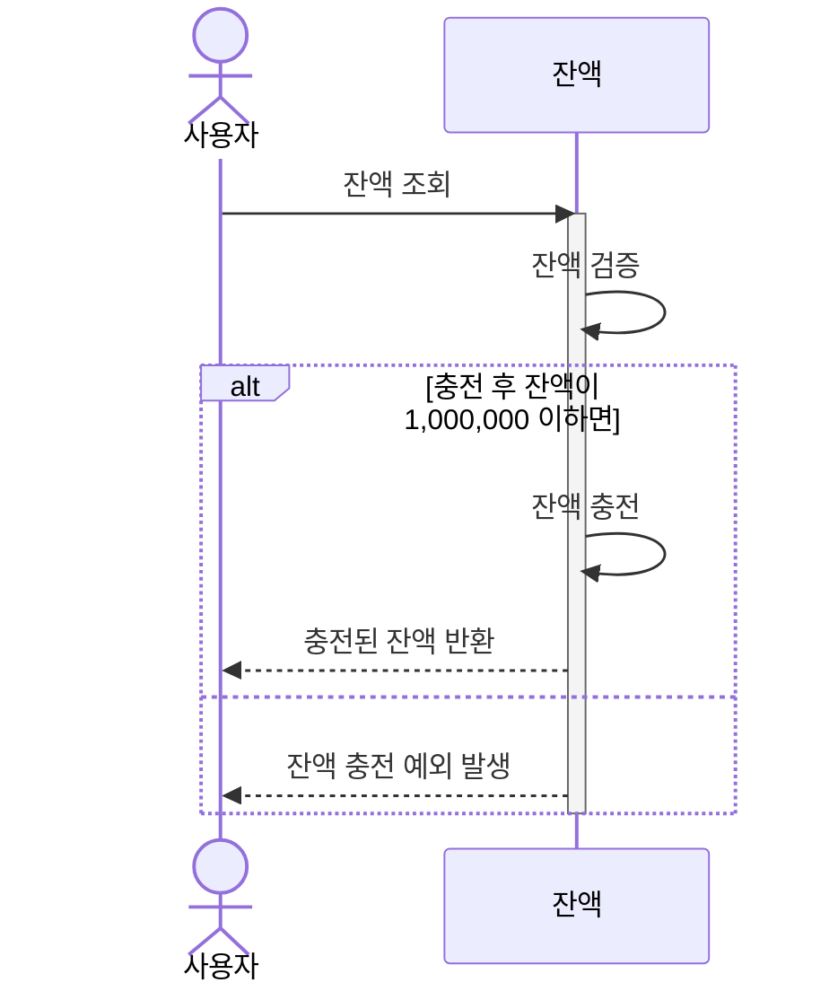
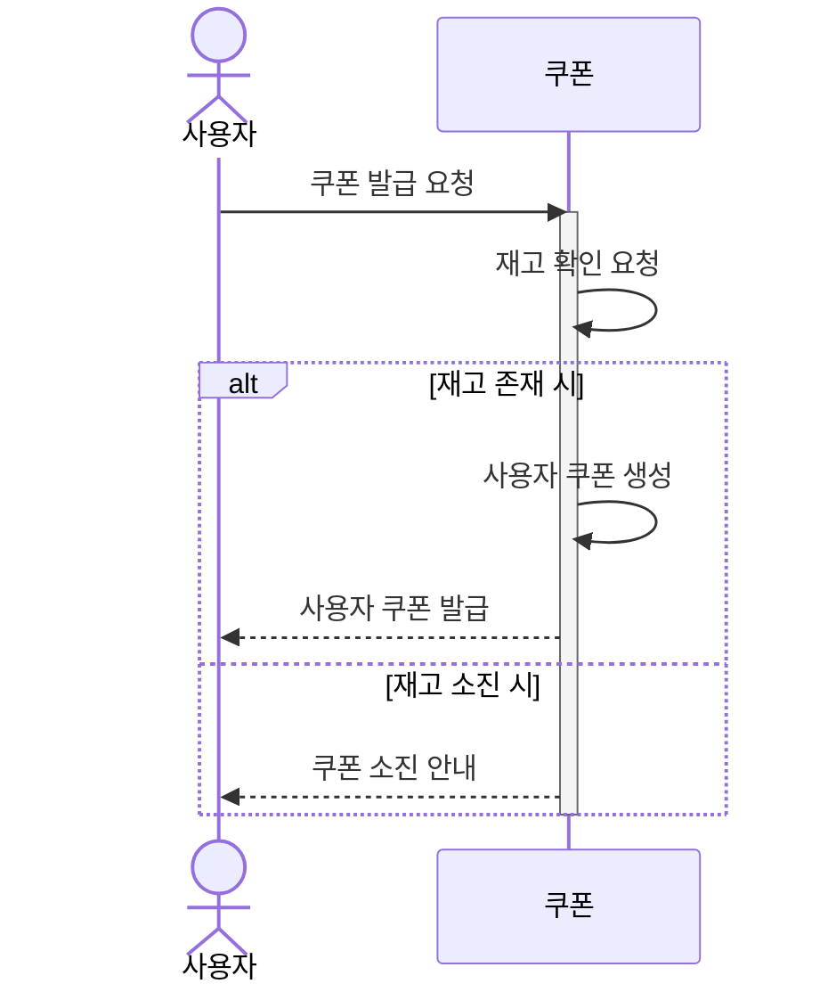
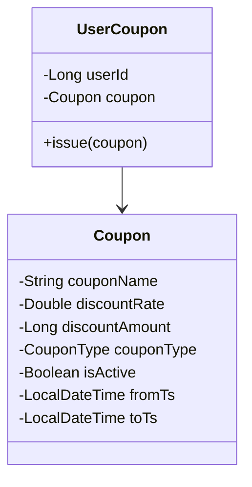
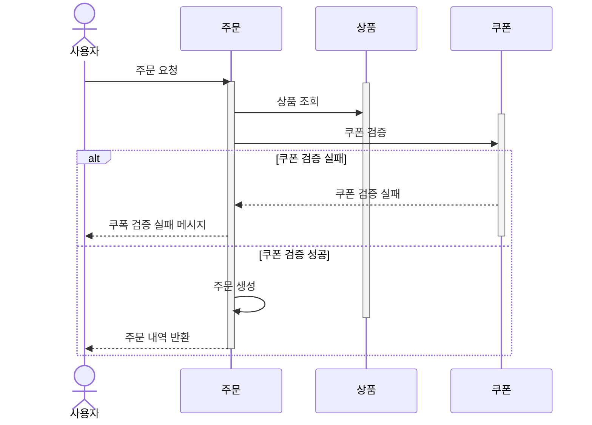
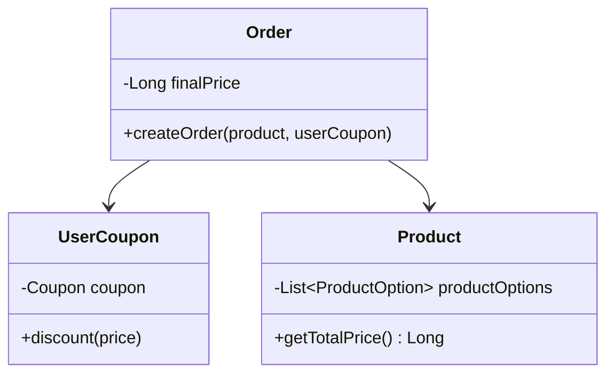
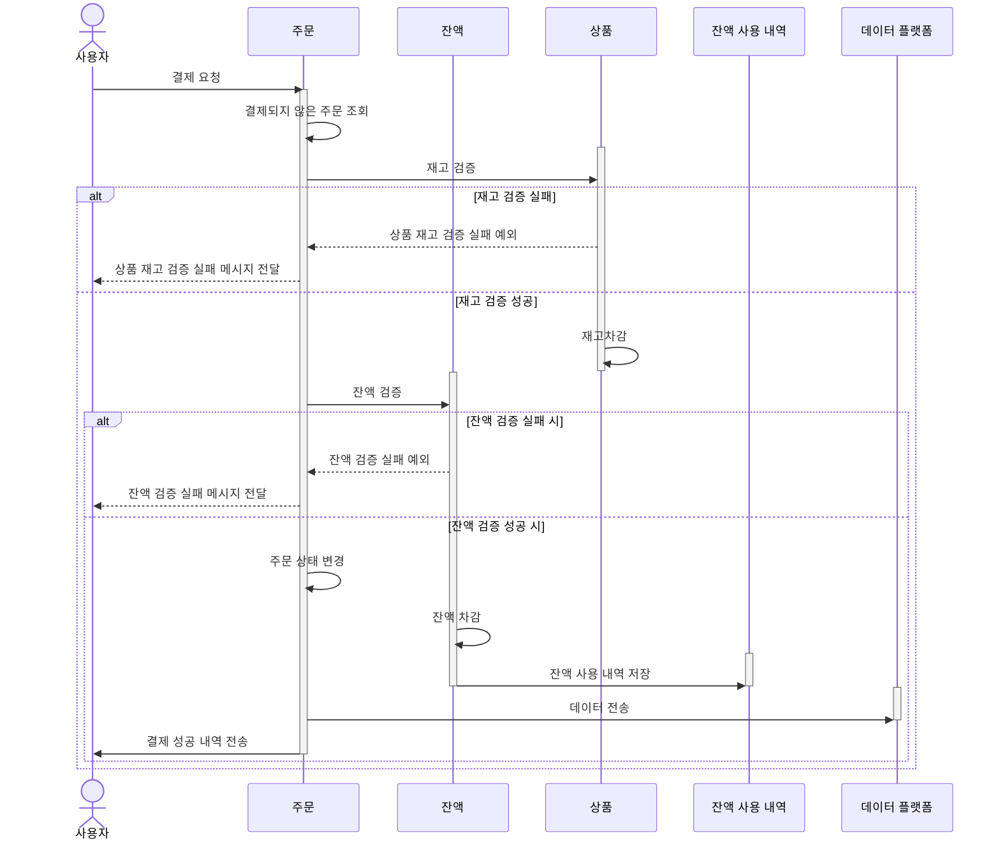
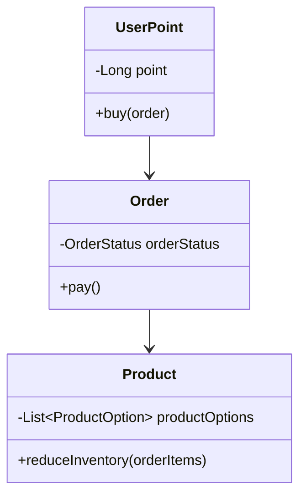
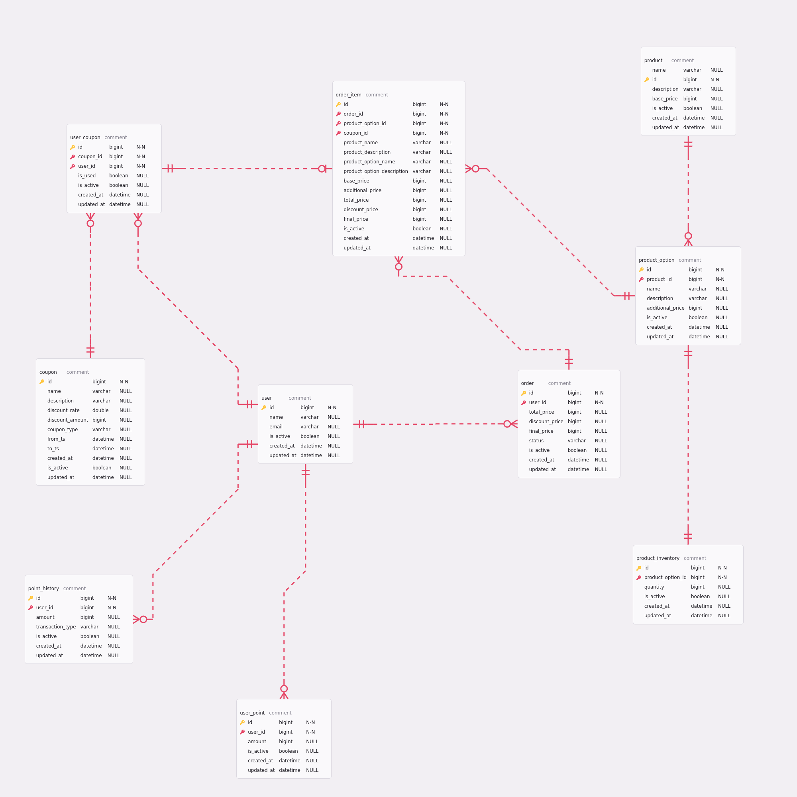

# e-커머스 설계 문서

작성자: 홍석호

작성일: 2025-04-04

e-커머스 설계에 대한 이해도를 높이기 위해 작성된 문서입니다.

전체 기능에 대한 ERD와 핵심 기능에 대한 정책, 시퀸스 다이어그램, 클래스 다이어그램을 포함하고 있습니다.

## 목차

1. [시스템 소개](#시스템-소개)
2. [필요한 컴포넌트](#필요한-컴포넌트)
3. [잔액 충전](#잔액-충전)
    - [정책](#정책)
    - [시퀸스 다이어그램](#시퀸스-다이어그램)
4. [선착순 쿠폰 발급](#선착순-쿠폰-발급)
    - [정책](#정책-1)
    - [시퀸스 다이어그램](#시퀸스-다이어그램-1)
    - [클래스 다이어그램](#클래스-다이어그램)
5. [주문](#주문)
    - [정책](#정책-2)
    - [시퀸스 다이어그램](#시퀸스-다이어그램-2)
    - [클래스 다이어그램](#클래스-다이어그램-1)
6. [결제](#결제)
    - [정책](#정책-3)
    - [시퀸스 다이어그램](#시퀸스-다이어그램-3)
    - [클래스 다이어그램](#클래스-다이어그램-2)
7. [ERD](#erd)

## 시스템 소개

e-커머스 시스템은 사용자가 상품을 구매하고 결제하는 시스템입니다.
이 시스템은 아래와 같은 기능을 제공합니다.

1. 사용자는 쿠폰을 발급받고, 잔액을 충전하여 상품을 구매할 수 있습니다.
2. 시스템은 주문과 결제를 처리하며, 데이터 플랫폼과 상호작용하여 결제 성공 시 주문 정보를 제공합니다.
3. 시스템은 상품 재고를 관리하고, 쿠폰 발급과 잔액 충전 시 동시성을 고려하여 설계되었습니다.
4. 시스템은 잔액, 상품, 쿠폰을 사용자에게 제공합니다.
5. 시스템은 특정 조건에 따라 바뀌는 상품 목록을 제공합니다.

이를 통해서 사용자는 상품을 구매하고 결제하는 과정에서 편리함을 느낄 수 있습니다.
또한 시스템은 데이터 플랫폼과 상호작용하여 결제 성공 시 주문 정보를 제공함으로써, 데이터 분석을 통해 사용자에게 더 나은 서비스를 제공할 수 있습니다.

## 구성요소

* 사용자
* 쿠폰
    * 사용자 쿠폰
* 잔액
    * 사용자 잔액
    * 충전/사용 내역
* 상품
    * 상품 옵션
    * 재고
* 주문
    * 주문 상품
    * 주문 상태
* 데이터 플랫폼

## 잔액 충전

### 정책

- 잔액 충전/사용 시 충전/사용 내역을 함께 저장해야 합니다.
- 최소 잔액은 0, 최대 잔액은 1,000,000입니다.
- 동시에 충전/사용이 발생해도 사용자 잔액이 누락되어서는 안됩니다.

### 시퀸스 다이어그램

## 선착순 쿠폰 발급

### 정책

- 쿠폰 재고 소진 시 "쿠폰 소진"과 같은 안내 메시지가 사용자에게 전달되어야 합니다.
- 쿠폰 재고 소진은 동시성이 고려되어야 합니다.
- 쿠폰 재고 소진 상태는 쿠폰 재고 확인 시 재고가 0인 경우를 의미합니다.
- 쿠폰 재고는 최소 0, 최대는 쿠폰이 현재 가진 재고입니다.
- 쿠폰은 할인율 또는 할인 금액으로 나뉩니다.
    - 할인율은 구매 가격과 곱한 값을 결제 금액에서 차감합니다.
    - 할인 금액은 결제 금액에서 바로 차감합니다.

### 시퀸스 다이어그램

### 클래스 다이어그램

## 주문

### 정책

#### 상품

- 상품 재고 소진은 동시성이 고려되어야 합니다.
- 상품 재고 소진 상태는 상품 재고 확인 시 재고가 0인 경우를 의미합니다.
- 상품 재고는 최소 0, 최대는 상품이 현재 가진 재고입니다.

#### 쿠폰

- 쿠폰 검증은 사용 가능 상태여야하며 만료일이 현재 시점보다 작아서는 안됩니다.

### 시퀸스 다이어그램

### 클래스 다이어그램

## 결제

### 정책

#### 주문

- <b>일부 상품에 대해서 재고 검증에 실패하면 해당 상품은 결제에서 제외</b>됩니다.
    - 상품을 다건을 주문한 경우 재고 검증에 실패한 물건은 주문에서 제외되고 나머지는 포함됩니다.
    - 주문하려는 모든 상품에 대해서 재고 검증에 실패한 경우 결제는 실패합니다.
- 잔액 검증에 실패하면 결제는 더 이상 진행되지 않습니다.
- 주문은 아래와 같은 상태를 가집니다.
    - "주문" 상태에서 결제가 성공적으로 진행되면 "결제 완료" 상태가 됩니다.

#### 잔액

- 잔액 충전/사용 시 충전/사용 내역을 함께 저장합니다.
- 최소 잔액은 0, 최대 잔액은 1,000,000입니다.
- 동시에 충전/사용이 발생해도 사용자 잔액이 누락되어서는 안됩니다.

### 시퀸스 다이어그램

### 클래스 다이어그램

## ERD

- 주문 상품에 대한 쿠폰 개별 적용을 위해 사용자 쿠폰과 주문 상품이 1:N 관계로 설정되어 있습니다.
- 상품은 상품에 대한 다양한 옵션을 소유하는 상품 옵션과 상품에 대한 재고를 소유하는 상품 재고로 구성되어 있습니다.