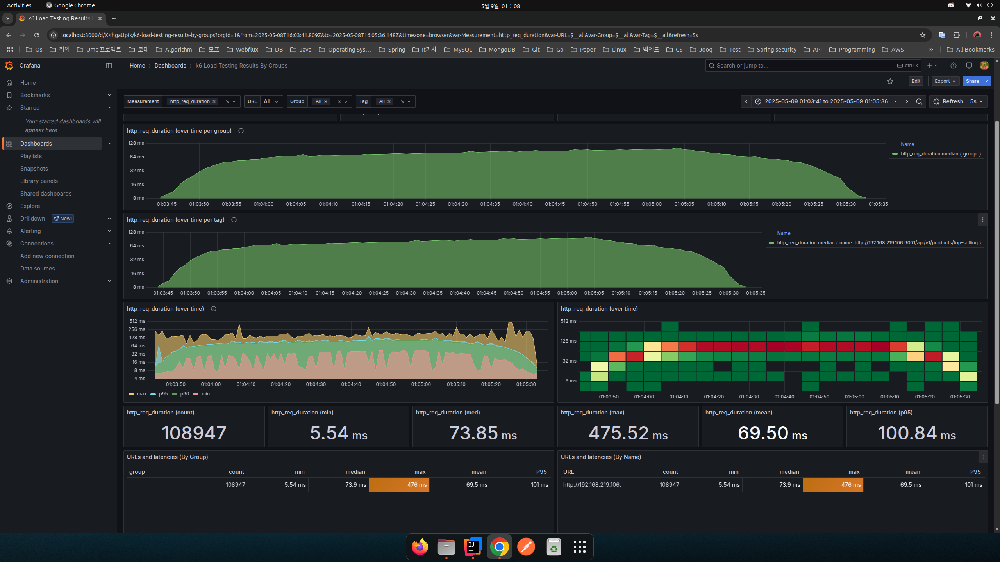
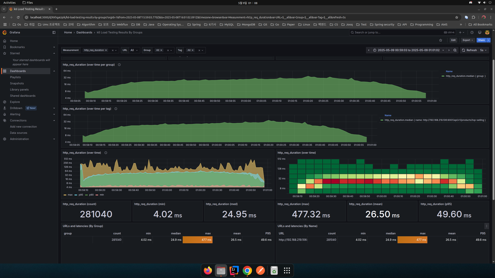
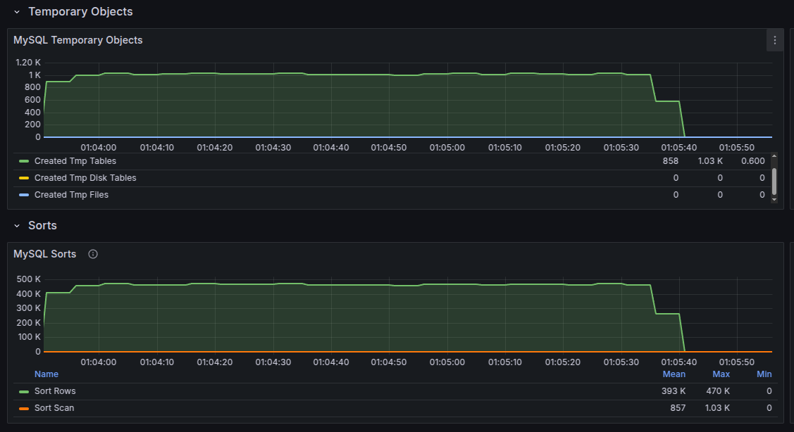
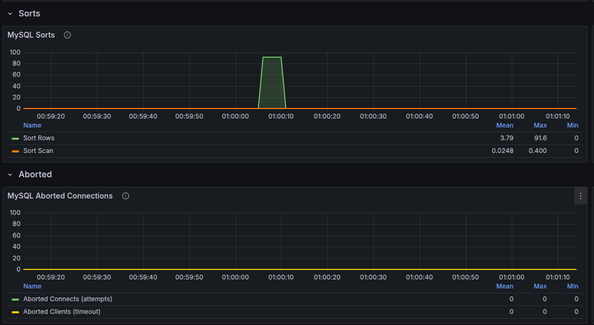

# 쿼리 분석 및 개선 문서

작성자: 홍석호

작성일: 2025-04-04

기존 API에 대한 성능을 분석하고 개선 방안을 제안하는 문서입니다.

API의 응답 속도가 실시간 서빙에 부하를 발생시킬 것이라 판단되면 개선 방안을 제안합니다.

성능 테스트 환경은 Intel® Core™ i5-10400 CPU @ 2.90GHz × 12, Ram 32GB, SSD 2.6TB입니다.
인텔리제이 IDE에서 실행한 스프링 애플리케이션과 Docker로 기동한 MySQL, Redis를 사용했습니다.

## 목차
1. [상위 상품 조회](#상위-상품-조회)
   1. [상위 상품 조회 API 문제점 분석](#상위-상품-조회-API-문제점-분석)
   2. [상위 상품 조회 API 개선 방안](#상위-상품-조회-API-개선-방안)
   3. [구조 변경 시 예상되는 장점](#구조-변경-시-예상되는-장점)
   4. [구조 변경 시 예상되는 단점](#구조-변경-시-예상되는-단점)

## 상위 상품 조회

### 상위 상품 조회 API 문제점 분석
상위 상품 조회 API는 상품에 대하여 판매량을 기준으로 상위 5개 상품을 조회합니다.

집계 쿼리가 실시간 서빙에 부하를 일으킬 것으로 예상되어 Materialized View를 사용하여 1시간 단위로 데이터를 집계해 저장하고 있습니다.

하지만, API에서 Materialized View 테이블에서 3일 동안의 데이터를 집계해서 랭킹을 산정하는 부분이 부하를 일으킬 것으로 예상됩니다.

## 상위 상품 조회 API 개선 방안
상위 상품 조회는 총 2번의 쿼리를 사용합니다.

1. Materialized View에서 상위 상품 랭킹 집계 쿼리
2. 상위 상품 랭킹에 해당하는 상품의 재고 조회 쿼리

1번 쿼리의 결과를 1시간 단위로 동작하는 상위 상품 집계 스케줄러에서 미리 캐싱하는 구조로 변경합니다.
API에서는 항상 먼저 캐시에서 조회하며, 스케줄러 실패 시에도 안정적인 서비스를 위해 캐시 미스가 발생하면 DB에서 직접 조회한 후 결과를 캐시에 저장합니다.

<b>주기적인 스케줄러를 통한 선제적 캐시 갱신과, API 레벨에서의 Cache-Aside 전략을 조합</b>하여 사용합니다.
### 상위 상품 조회 스케줄러

### 상위 상품 조회 API

## 구조 변경 시 예상되는 장점
### API 응답 성능 향상

<b>캐시 적용 전</b>

캐시 적용 전 p95 기준 응답 속도는 100.84ms입니다.

<b>캐시 적용 후</b>

캐시 적용 후 p95 기준 응답 속도는 49.60ms입니다.

결과적으로 캐시 적용 후 <b>p95 기준 응답 속도가 50% 이상 향상</b>되었습니다.

### DB 부하 감소

<b>캐시 적용 전</b>

캐시 적용 전에는 집계 쿼리와 정렬로 인한 임시 객체와 정렬로 인한 부하가 발생합니다.

<b>캐시 적용 후</b>

캐시 적용 후에는 DB에서 집계와 정렬을 하지 않고 캐시에서 조회하기 때문에 DB 부하가 줄어듭니다.

## 구조 변경 시 예상되는 단점
1. 데이터 일관성: 캐시를 사용하여 데이터 일관성이 떨어질 수 있습니다.
2. 캐시 갱신: 캐시를 갱신하기 위한 스케줄링 작업과 해당 작업의 성공 유무를 파악할 수 있는 시스템을 구축해야 합니다.
3. 고가용성 확보: 캐시 서버의 장애 발생 시에도 서비스가 중단되지 않도록 구성해야 합니다.

데이터 일관성은 상위 상품 랭킹만 캐싱하여 실시간 재고에는 영향을 미치지 않습니다. 이미 상위 상품 랭킹이 Materialized View에 저장된 데이터로 집계되므로 실시간 동기화가 필요 없습니다.
캐시 운영과 갱신 관리가 필요하지만 이에 따라 얻을 수 있는 성능 향상과 부하 감소는 충분히 가치가 있습니다.

## 결론
캐싱을 통해서 상위 상품 조회 API는 캐시를 사용하여 성능을 50% 향상시키고 불필요한 임시 객체 생성과 정렬을 제거하여 DB 부하를 줄일 수 있습니다.
추가로 캐시 운영, 관리, 장애 대응을 위한 시스템 구축을 고민해야 합니다.

