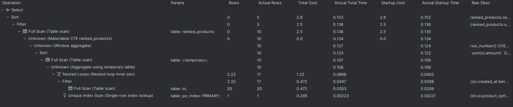
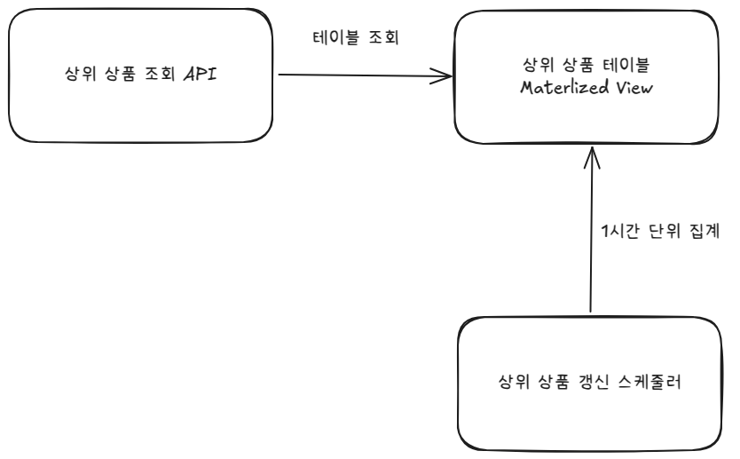
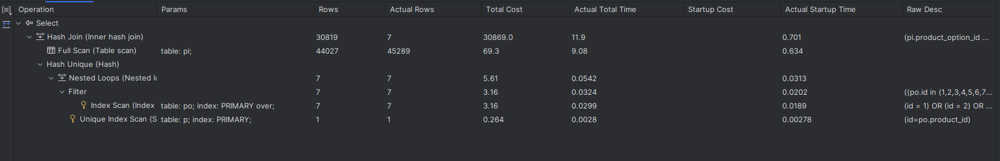
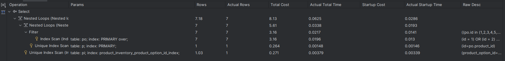

# 쿼리 분석 및 개선 문서

작성자: 홍석호

작성일: 2025-04-04

현재 작성된 쿼리를 분석하고 문제점을 파악하여 개선 방안을 제안하는 문서입니다.

우선, 대용량 데이터를 대상으로 쿼리가 이루어진다고 가정합니다.

해당 쿼리로 API 실시간 서빙이 부하를 발생시킬 것이라 판단이 되면 개선 방안을 제안합니다.

## 목차
1. [상위 상품 조회](#상위-상품-조회)
   1. [상위 상품 조회 쿼리](#상위-상품-조회-쿼리)
   2. [상위 상품 조회 쿼리 문제점 분석](#문제점-분석)
   3. [상위 상품 조회 쿼리 개선 방안](#상위-상품-조회-쿼리-개선-방안)
   4. [구조 변경 시 예상되는 장점](#구조-변경-시-예상되는-장점)
   5. [구조 변경 시 예상되는 단점](#구조-변경-시-예상되는-단점)
   6. [결론](#결론)
2. [상품 조회](#상품-조회)
   1. [상품 조회 쿼리](#상품-조회-쿼리)
   2. [상품 조회 쿼리 문제점 분석](#문제점-분석)
   3. [상품 조회 쿼리 개선 방안](#상품-조회-쿼리-개선-방안)
   4. [예상되는 장점](#예상되는-장점)
   5. [예상되는 단점](#예상되는-단점)
   6. [결론](#결론)

## 상위 상품 조회
### 상위 상품 조회 쿼리
```sql
WITH ranked_products AS (SELECT po.product_id                                    AS productId,
                                ROW_NUMBER() OVER (ORDER BY SUM(oi.amount) DESC) AS sellingRank
                         FROM order_item AS oi
                         JOIN product_option AS po ON oi.product_option_id = po.id
                         WHERE oi.created_at BETWEEN :from AND :to
                         GROUP BY po.product_id)
SELECT ranked_products.productId,
       ranked_products.sellingRank
FROM ranked_products
WHERE ranked_products.sellingRank <= 5
ORDER BY ranked_products.sellingRank
```
해당 쿼리로 상품에 대하여 판매량을 기준으로 상위 5개 상품을 조회합니다.

```sql
SELECT *
FROM product AS p
JOIN p.productOptions AS po 
JOIN po.productInventory 
WHERE p.id IN :productIds
```
해당 쿼리로 상품에 대하여 상위 5개 상품의 상세 정보(재고)를 조회합니다.

그 후에 애플리케이션 수준에서 상품 정보를 조합하여 최종 결과를 반환합니다.

### 문제점 분석
1. **서브쿼리 사용**: WITH절을 이용한 서브쿼리는 대용량 데이터셋에서 성능 저하를 유발할 수 있습니다.
주문 상품과 상품 옵션 테이블의 데이터 양이 많아졌을 때, 주문 수량의 합을 집계 하기 위한 임시 테이블의 사용은 비효율적일 수 있습니다.

2. **JOIN 사용**: 주문 상품과 상품 옵션 테이블의 데이터 양이 많아졌을 때, JOIN을 사용하여 데이터를 결합하는 것은 성능 저하를 유발할 수 있습니다.
3일 동안 주문 상품이 100만건이 발생했다고 가정했을 때, 100만건의 주문 상품과 각 주문 상품에 해당하는 상품 옵션을 JOIN하여 데이터를 결합하는 것은 성능 저하를 유발할 수 있습니다.

### 상위 상품 조회 쿼리 개선 방안
상위 상품 조회의 특성상 **실시간으로 집계하여 결과를 반환할 필요가 없습니다**.

정책에 따르면 상위 상품 조회는 오늘을 제외하고 어제, 그제, 3일 전의 데이터를 기준으로 집계하여 결과를 반환합니다.

따라서, 상위 상품 조회 쿼리를 개선하기 위해서는 다음과 같은 방법을 사용할 수 있습니다.



1. **Materialized View 사용**: 상위 상품 조회 쿼리를 Materialized View로 생성하여, 주기적으로 집계된 결과를 저장합니다.
   - Materialized View는 쿼리 결과를 저장하여, 이후에 해당 결과를 재사용할 수 있도록 합니다.
   - 이를 통해, 매번 쿼리를 실행하는 것보다 성능을 향상시킬 수 있습니다.
   - 매일 1시간 단위로 Materialized View에 주문 수량의 합을 상품마다 집계해 저장합니다.
2. **주문 상품의 생성 시간 칼럼에 인덱스 추가**: 주문 상품의 생성 시간 칼럼에 인덱스를 추가하여, 집계 쿼리 성능을 향상시킬 수 있습니다.
   - 생성 시간에 인덱스를 추가하면, 매일 1시간 단위로 집계된 결과를 저장할 때, 인덱스를 사용하여 집계 쿼리 성능을 향상시킬 수 있습니다.

### 구조 변경 시 예상되는 장점
1. **성능 향상**: Materialized View를 사용하여 쿼리 성능을 향상시킬 수 있습니다.
   - 매번 쿼리를 실행하는 것보다, 저장된 결과를 재사용하는 것이 더 빠릅니다.
   - 서버와 DB의 부하를 줄일 수 있습니다.

### 구조 변경 시 예상되는 단점
1. **데이터 일관성**: Materialized View는 주기적으로 갱신되므로, 데이터 일관성이 떨어질 수 있습니다.
   - 예를 들어, 주문 상품이 추가되거나 변경되었을 때, Materialized View가 갱신되지 않으면 최신 정보를 반영하지 못할 수 있습니다.
2. **갱신 작업에 대한 추가 작업**:
   - Materialized View를 갱신하기 위한 스케줄링 작업과 해당 작업의 성공 유무를 파악할 수 있는 시스템을 구축해야 합니다.
   - 스케줄링이 실패할 경우에도 상위 상품 조회에는 문제가 없도록 구성해야 합니다.

### 결론
Materialized View를 사용하여 상위 상품 조회 쿼리를 개선하는 것은 성능을 향상시키려고 합니다. 

이를 위해서는 갱신 작업에 대한 추가 작업이 필요합니다.

하지만 상위 상품 조회의 특성상 실시간성 동기화가 필요 없다는 점과 상위 상품 조회 쿼리의 성능 저하를 고려했을 때, 

**스케줄링과 Materialized View를 사용**해 상위 상품 조회 쿼리를 개선하려고 합니다.


## 상품 조회
### 상품 조회 쿼리
```java
  @Query("SELECT p " 
        + "FROM Product p " 
        + "JOIN FETCH p.productOptions po " 
        + "JOIN FETCH po.productInventory " 
        + "WHERE p.id IN :productIds")
  List<Product> findAllFetchedByIdIn(List<Long> productIds);

  @Query("SELECT p " 
          + "FROM Product p " 
          + "JOIN FETCH p.productOptions po " 
          + "JOIN FETCH po.productInventory " 
          + "WHERE po.id IN :productOptionIds")
  List<Product> findAllByProductOptionsIdIn(List<Long> productOptionIds);

  @Query("SELECT p " 
          + "FROM Product p " 
          + "JOIN FETCH p.productOptions po " 
          + "JOIN FETCH po.productInventory")
  List<Product> findAllFetched();
```

### 문제점 분석


1. **JOIN 사용**: 쿼리에서 상품 재고 테이블과 조인할 때 상품 재고 테이블에는 인덱스가 없습니다.
상품 또는 상품 옵션의 아이디로 필터링이 되고 JOIN이 이루어지기 때문에 괜찮습니다. 
하지만 이후에 상품 재고와 JOIN은 Full Scan이 이루어집니다.  

### 상품 조회 쿼리 개선 방안


1. 상품 재고 테이블에 상품 옵션 아이디에 인덱스를 추가합니다. 
   - 상품 재고 테이블에 상품 옵션 아이디에 인덱스를 추가하여, JOIN 성능을 향상시킬 수 있습니다.
   - 상품 또는 상품 옵션의 아이디로 필터링이 이루어지기 때문에 JOIN이 이루어지면 성능 저하가 발생하지 않을 것으로 판단됩니다.

### 예상되는 장점
1. **성능 향상**: 상품 재고 테이블에 상품 옵션 아이디에 인덱스를 추가하여, JOIN 성능을 향상시킬 수 있습니다.

### 예상되는 단점
1. 데이터가 많아지면 JOIN에 인덱스가 생성되어도 성능 저하가 발생할 수 있습니다.
2. 인덱스의 추가로 인해 데이터 삽입, 수정, 삭제 시 성능 저하가 발생할 수 있습니다.

### 결론
현재 제공되는 기능을 보면  주로 상품 또는 상품 재고의 아이디로 필터링이 이루어지기 때문에 JOIN을 사용해도 
엄청난 성능 저하가 발생하지 않을 것으로 판단됩니다.

또한, 상품과 상품 옵션, 상품 재고 테이블은 쓰기가 많지 않고 읽기가 많기 때문에 인덱스를 추가해도 쓰기 속도의 손실이 크지 않을 것으로 판단됩니다.

그래서 **상품 재고 테이블에 상품 옵션 아이디에 인덱스를 추가**하여 JOIN 성능을 향상시키려고 합니다.

하지만 JOIN에 인덱스를 추가하고도 성능 저하가 발생한다면,
상품과 상품 옵션는 JOIN으로 조회하고, 상품 재고는 별도로 조회하여 애플리케이션 수준에서 조립할 수 있도록 개선할 수 있습니다.
